> ⚠️⚠️⚠️：以下全文摘抄引用自 《计算机网络》（第6版）谢希仁编著，
> 根据行文需要添加适当过渡语句。
> 


## 1. 计算机网络中的TCP

### 1.1 开放系统互连参考模型的发展

在计算机网络的发展过程中人们逐渐总结出了一套分层次的计算机网络体系结构，称为 **开放系统互连参考模型**。

1974年，美国的IBM公司宣布了系统网络体系结构SNA (System Network Architecture)。这个著名的网络标准就是按照分层的方法制定的。现在用IBM大型机构建的专用网络仍在使用SNA。不久后，其他一些公司也相继推出自己公司的具有不同名称的体系结构。不同的网络体系结构出现后，使用同一个公司生产的各种设备都能够很容易地互连成网。这种情况显然有利于一个公司垄断市场。用户一旦购买了某个公司的网络，当需要扩大容量时，就只能再购买原公司的产品。如果购买了其他公司的产品，那么由于网络体系结构的不同，就很难互相连通。然而，全球经济的发展使得不同网络体系结构的用户迫切要求能够互相交换信息。为了使不同体系结构的计算机网络都能互连，国际标准化组织ISO于1977年成立了专门机构研究该问题。不久，他们就提出一个试图使各种计算机在世界范围内互连成网的标准框架，即著名的开放系统互连基本参考模型OSI/RM (Open Systems Interconnection Reference Model)，简称为OSI。“开放”是指非独家垄断的。

因此只要遵循OSI标准，一个系统就可以和位于世界上任何地方的、也遵循这同一标准的其他任何系统进行通信。这一点很像世界范围的电话和邮政系统，这两个系统都是开放系统。“系统”是指在现实的系统中与互连有关的各部分（我们知道，并不是一个系统中的所有部分都与互连有关。OSI/RM参考模型是把与互连无关的部分除外，而仅仅考虑与互连有关的那些部分）。所以开放系统互连参考模型OSI/RM是个抽象的概念。在1983年形成了开放系统互连基本参考模型的正式文件，即著名的ISO 7498国际标准，也就是所谓的七层协议的体系结构。
OSI试图达到一种理想境界，即全世界的计算机网络都遵循这个统一的标准，因而全世界的计算机将能够很方便地进行互连和交换数据。在20世纪80年代，许多大公司甚至一些国家的政府机构纷纷表示支持OSI。当时看来似乎在不久的将来全世界一定会按照OSI制定的标准来构造自己的计算机网络。然而到了20世纪90年代初期，虽然整套的OSI国际标准都已经制定出来了，但由于因特网已抢先在全世界覆盖了相当大的范围，而与此同时却几乎找不到有什么厂家生产出符合OSI标准的商用产品。因此人们得出这样的结论：OSI只获得了一些理论研究的成果，但在市场化方面OSI则事与愿违地失败了。现今规模最大的、覆盖全世界的因特网并未使用OSI标准。OSI失败的原因可归纳为：

1. OSI的专家们缺乏实际经验，他们在完成OSI标准时缺乏商业驱动力；
2. OSI的协议实现起来过分复杂，而且运行效率很低；
3. OSI标准的制定周期太长，因而使得按OSI标准生产的设备无法及时进入市场；
4. OSI的层次划分不太合理，有些功能在多个层次中重复出现。
  
按照一般的概念，网络技术和设备只有符合有关的国际标准才能大范围地获得工程上的应用。但现在情况却反过来了。得到最广泛应用的不是法律上的国际标准 OSI，而是非国际标准TCP/IP。这样，TCP/IP就常被称为是事实上的国际标准。从这种意义上说，能够占领市场的就是标准。在过去制定标准的组织中往往以专家、学者为主。但现在许多公司都纷纷挤进各种各样的标准化组织，使得技术标准具有浓厚的商业气息。一个新标准的出现，有时不一定反映其技术水平是最先进的，而是往往有着一定的市场背景。

顺便说一下，虽然OSI标准在一开始是由ISO来制定，但后来的许多标准都是ISO与原来的国际电报电话咨询委员会CCITT联合制定的。从历史上来看，CCITT原来是从通信的角度考虑一些标准的制定，而ISO则关心信息的处理。但随着科学技术的发展，通信与信息处理的界限变得比较模糊了。于是，通信与信息处理就都成为CCITT与ISO所共同关心的领域。CCITT的建议书X.200就是关于开放系统互连参考模型，它和上面提到的ISO 7498基本上是相同的。

### 1.2 具有五层协议的体系结构

OSI的七层协议体系结构（图1-18(a)）的概念清楚，理论也较完整，但它既复杂又不实用。TCP/IP体系结构则不同，它现在已经得到了非常广泛的应用。

TCP/IP是一个四层的体系结构（图1-18(b)），它包含应用层、运输层、网际层和网络接口层（用网际层这个名字是强调这一层是为了解决不同网络的互连问题）。

不过从实质上讲，TCP/IP只有最上面的三层，因为最下面的网络接口层基本上和一般的通信链路在功能上没有多大差别，对于计算机网络来说，这一层并没有什么特别新的具体内容。

因此在学习计算机网络的原理时往往采取折中的办法，即综合OSI和TCP/IP的优点，采用一种只有五层协议的体系结构（图1-18(c)），这样既简洁又能将概念阐述清楚。

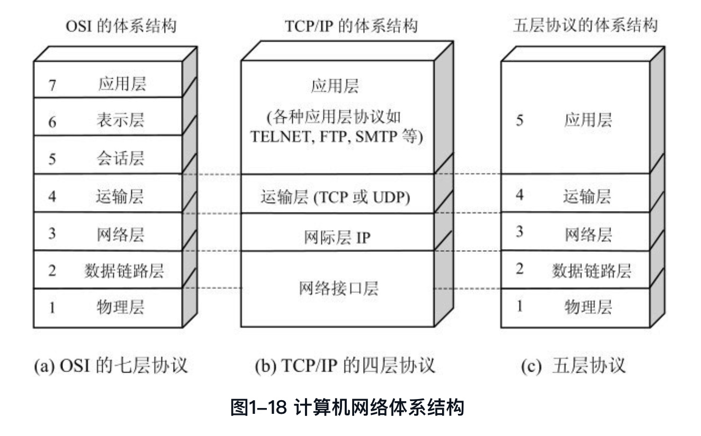  

现在结合因特网的情况，自上而下地、非常简要地介绍一下各层的主要功能。实际上，只有认真学习完本书各章的协议后才能真正弄清各层的作用。

#### (1) 应用层(application layer)
应用层是体系结构中的最高层。应用层的任务是通过应用进程间的交互来完成特定网络应用。应用层协议定义的是应用进程间通信和交互的规则。这里的进程(process)就是指主机中正在运行的程序。对于不同的网络应用需要有不同的应用层协议。在因特网中的应用层协议很多，如支持万维网应用的HTTP协议，支持电子邮件的SMTP协议，支持文件传送的FTP协议，等等。我们将应用层交互的数据单元称为报文(message)。

#### (2) 运输层(transport layer)

运输层的任务就是负责向两个主机中进程之间的通信提供通用的数据传输服务。应用进程利用该服务传送应用层报文。所谓通用，是指并不针对某个特定网络应用，而是多种应用可以使用同一个运输层服务。由于一台主机可同时运行多个进程，因此运输层有复用和分用的功能。复用就是多个应用层进程可同时使用下面运输层的服务，分用与复用相反，是运输层把收到的信息分别交付上面应用层中的相应进程。运输层主要使用以下两种协议：
- 传输控制协议TCP (Transmission Control Protocol)——提供面向连接的、可靠的数据传输服务，其数据传输的单位是报文段(segment)。
- 用户数据报协议 UDP (User Datagram Protocol)——提供无连接的、尽最大努力(best-effort)的数据传输服务（不保证数据传输的可靠性），其数据传输的单位是用户数据报。

#### (3) 网络层(network layer)

网络层负责为分组交换网上的不同主机提供通信服务。
在发送数据时，网络层把运输层产生的报文段或用户数据报封装成分组或包(packet)进行传送。

在TCP/IP体系中，由于网络层使用IP协议，因此分组也叫作 IP数据报，或简称为数据报(datagram)。
本书把“分组”和“数据报”作为同义词使用。
请注意：不要将运输层的“用户数据报UDP”和网络层的“IP数据报”弄混。
此外，无论在哪一层传送的数据单元，都可笼统地用“分组”来表示。
网络层的另一个任务就是要选择合适的路由，使源主机运输层所传下来的分组能够通过网络中的路由器找到目的主机。
这里要强调指出，网络层中的“网络”二字，已不是我们通常谈到的具体的网络，而是在计算机网络体系结构模型中的专用名词。

因特网是一个很大的互联网，它由大量的异构(heterogeneous)网络通过路由器(router)相互连接起来。
因特网主要的网络层协议是无连接的网际协议IP (Internet Protocol)和许多种路由选择协议，因此因特网的网络层也叫做网际层或IP层。
在本书中，网络层、网际层和IP层都是同义语。

#### (4) 数据链路层(data link layer)

数据链路层常简称为链路层。
我们知道，两台主机之间的数据传输，总是在一段一段的链路上传送的，这就需要使用专门的链路层的协议。
在两个相邻结点之间传送数据时，数据链路层将网络层交下来的IP数据报组装成帧（framing），在两个相邻结点间的链路上传送帧（frame）。
每一帧包括数据和必要的控制信息（如同步信息、地址信息、差错控制等）。
在接收数据时，控制信息使接收端能够知道一个帧从哪个比特开始和到哪个比特结束。
这样，数据链路层在收到一个帧后，就可从中提取出数据部分，上交给网络层。

控制信息还使接收端能够检测到所收到的帧中有无差错。
如发现有差错，数据链路层就简单地丢弃这个出了差错的帧，以免继续在网络中传送下去白白浪费网络资源。

如果需要改正数据在数据链路层传输时出现的差错（这就是说，数据链路层不仅要检错，而且要纠错），那么就要采用可靠传输协议来纠正出现的差错。
这种方法会使数据链路层的协议复杂些。

#### (5) 物理层(physical layer)

在物理层上所传数据的单位是比特。发送方发送1（或0）时，接收方应当收到1（或0）而不是0（或1）。因此物理层要考虑用多大的电压代表“1”或“0”，以及接收方如何识别出发送方所发送的比特。

物理层还要确定连接电缆的插头应当有多少根引脚以及各条引脚应如何连接。当然，解释比特代表的意思，就不是物理层的任务。请注意，传递信息所利用的一些物理媒体，如双绞线、同轴电缆、光缆、无线信道等，并不在物理层协议之内而是在物理层协议的下面。因此也有人把物理媒体当作第0层。

在因特网所使用的各种协议中，最重要的和最著名的就是TCP和IP两个协议。现在人们经常提到的TCP/IP并不一定是单指TCP和IP这两个具体的协议，而往往是表示因特网所使用的整个TCP/IP协议族(protocol suite)。图1-19说明的是应用进程的数据在各层之间的传递过程中所经历的变化。这里为简单起见，假定两台主机通过一台路由器连接起来。

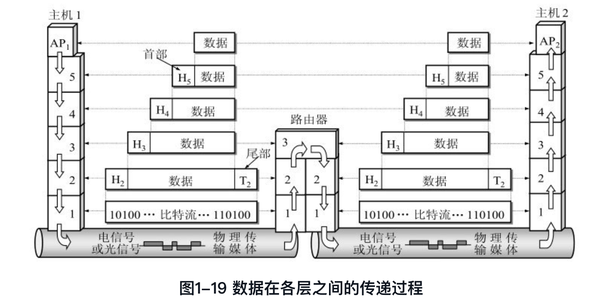  

假定主机1的应用进程 AP1（Application1）向主机2的应用进程 AP2（Application2）传送数据。AP1先将其数据交给本主机的第5层（应用层）。第5层加上必要的控制信息 H5（Header5）就变成了下一层的数据单元。
第4层（运输层）收到这个数据单元后，加上本层的控制信息 H4（Header4），再交给第3层（网络层），成为第3层的数据单元。
依此类推。不过到了第2层（数据链路层）后，控制信息被分成两部分，分别加到本层数据单元的首部 \[H2（Header2）]和尾部 \[T2（Tail2）]；而第1层（物理层）由于是比特流的传送，所以不再加上控制信息。
请注意，传送比特流时应从首部开始传送。

OSI参考模型把对等层次之间传送的数据单位称为该层的协议数据单元 PDU (Protocol Data Unit)。这个名词现已被许多非OSI标准采用。当这一串的比特流离开主机1的物理层经网络的物理媒体（传输信道）传送到路由器时，就从路由器的第1层（物理层）依次上升到第3层（网络层）。每一层都是根据控制信息进行必要的操作，然后将控制信息剥去，将该层剩下的数据单元上交给更高的一层。当分组上升到了第3层时，就根据首部中的目的地址查找路由器中的路由表，找出转发分组的接口，然后往下传送到第2层（链路层），加上新的首部和尾部后，再到最下面的第1层，然后在物理媒体上把每一个比特发送出去。

当这一串的比特流离开路由器到达目的站主机2时，就从主机2的第1层按照上面讲过的方式，依次上升到第5层。最后，把应用进程AP1发送的数据交给目的站的应用进程AP2。

可以用一个简单例子来比喻上述过程。有一封信从最高层向下传。每经过一层就包上一个新的信封，写上必要的、交由下一层处理的地址信息。包有多个信封的信件传送到目的站后，从第1层起，每层拆开一个信封后（即按协议进行处理后）就把信封中的信交给它的上一层。传到最高层后，取出发信人所发的信交给收信人。

虽然应用进程数据要经过如图1-19所示的复杂过程才能送到终点的应用进程，但这些复杂过程对用户来说，却都被屏蔽掉了，以致应用进程AP1 觉得好像是直接把数据交给了应用进程AP2。同理，任何两个同样的层次（例如在两个系统的第4层）之间，也好像如同图1-19中的水平虚线所示的那样，把数据（即数据单元加上控制信息）通过水平虚线直接传递给对方。这就是所谓的“对等层”(peerlayers)之间的通信。

我们以前经常提到的各层协议，实际上就是在各个对等层之间传递数据时的各项规定。在文献中也还可以见到术语“协议栈”(protocol stack)。这是因为几个层次画在一起很像一个栈(stack)的结构。

### 1.3 实体、协议、服务和服务访问点
当研究开放系统中的信息交换时，往往使用 **实体(entity)** 这一较为抽象的名词表示**任何可发送或接收信息的硬件或软件进程**。
在许多情况下，实体就是一个特定的软件模块。

协议是控制两个对等实体（或多个实体）进行通信的规则的集合。
协议在语法方面的规则定义了所交换的信息的格式；而协议在语义方面的规则就定义了发送者或接收者所要完成的操作，例如，在何种条件下数据必须重传或丢弃；协议在同步方面的规则定义了收发双方的时序关系，即在一定条件下应当发生什么事件。

**在协议的控制下，两个对等实体间的通信使得本层能够向上一层提供服务。要实现本层协议，还需要使用下面一层所提供的服务。**

一定要弄清楚，协议和服务在概念上是很不一样的。
首先，协议的实现保证了能够向上一层提供服务。
**使用本层服务的实体只能看见服务而无法看见下面的协议**。
也就是说，下面的协议对上面的实体是透明的。

其次，**协议是“水平的”，即协议是控制对等实体之间通信的规则**。
但**服务是“垂直的”，即服务是由下层向上层通过层间接口提供的**。
另外，并非在一个层内完成的全部功能都称为服务。
只有那些能够被高一层实体“看得见”的功能才能称之为“服务”。
上层使用下层所提供的服务必须通过与下层交换一些命令，这些命令在OSI中称为服务原语。
在同一系统中相邻两层的实体进行交互(即交换信息)的地方，通常称为**服务访问点 SAP (ServiceAccess Point)**。
服务访问点SAP是一个抽象的概念，它实际上就是一个逻辑接口，有点像邮政信箱（可以把邮件放入信箱和从信箱中取走邮件），但这种层间接口和两个设备之间的硬件接口（并行的或串行的）并不一样。
OSI把层与层之间交换的数据的单位称为**服务数据单元SDU (Service DataUnit)**，它可以与协议数据单元PDU不一样。
例如，可以是多个SDU合成为一个PDU，也可以是一个SDU划分为几个PDU。
这样，在任何相邻两层之间的关系可概括为图1-20所示的那样。
这里要注意的是，第n层的两个“实体(n)”之间通过“协议(n)”进行通信，而第n + 1层的两个“实体(n + 1)”之间则通过另外的“协议(n + 1)”进行通信（每一层都使用不同的协议）。第n层向上面的第n + 1层所提供的服务实际上已包括了在它以下各层所提供的服务。第n层的实体对第n + 1层的实体就相当于一个服务提供者。在服务提供者的上一层的实体又称为“服务用户”，因为它使用下层服务提供者所提供的服务。

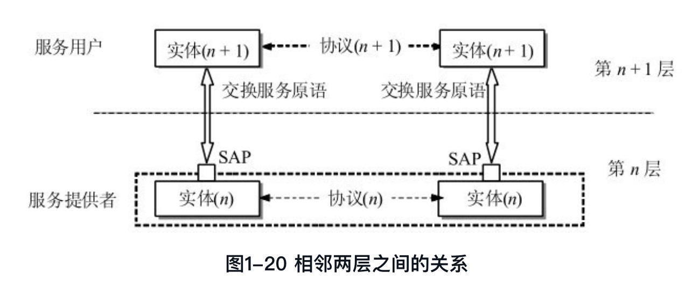  

计算机网络的协议还有一个很重要的特点，就是协议必须把所有不利的条件事先都估计到，而不能假定一切都是正常的和非常理想的。
例如，两个朋友在电话中约好，下午3时在某公园门口碰头，并且约定“不见不散”。
这就是一个很不科学的协议，因为任何一方临时有急事来不了而又无法通知对方时（如对方的电话或手机都无法接通），则另一方按照协议就必须永远等待下去。
因此，看一个计算机网络协议是否正确，不能只看在正常情况下是否正确，而且还必须非常仔细地检查这个协议能否应付各种异常情况。

### 1.4 TCP/IP的体系结构

前面已经说过，TCP/IP的体系结构比较简单，它只有四层。图1-22给出了用这种四层协议表示方法的例子。请注意，图中的路由器在转发分组时最高只用到网络层而没有使用运输层和应用层。

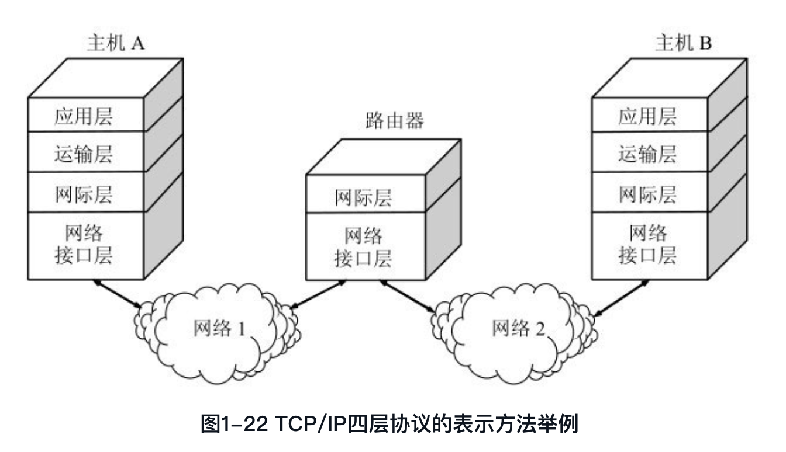  

应当指出，技术的发展并不是遵循严格的OSI分层的概念。实际上现在的因特网使用的TCP/IP体系结构有时已经演变成为图1-23所示的那样，即某些应用程序可以直接使用IP层，或直接使用最下面的网络接口层[PETE11]，图1-23是这种表示方法。在图中，网络接口层有时也称为子网层。但本书不采用“子网层”这种容易混淆的表示方法，因为这里的“子网”是指一些局域网和某些广域网（如ATM网），但从IP层来看，这些网络属于数据链路层，也就是属于网络接口层。我们在第4章4.3.1节，将会讲到“子网划分”。但子网划分中的“子网”和图1-23中“子网层”中的“子网”是完全不同的概念。

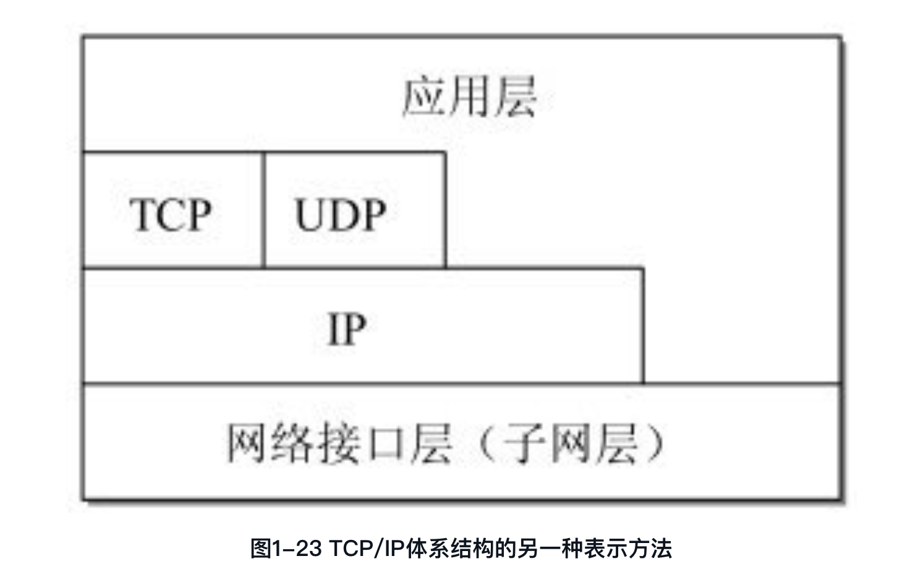  

还有一种方法，就是分层次画出具体的协议来表示TCP/IP协议族（图1-24），它的特点是上下两头大而中间小：应用层和网络接口层都有多种协议，而中间的IP层很小，上层的各种协议都向下汇聚到一个IP协议中。
这种很像沙漏计时器形状的TCP/IP协议族表明：**TCP/IP协议可以为各式各样的应用提供服务**（所谓的everything over IP），同时**TCP/IP协议也允许IP协议在各式各样的网络构成的互联网上运行**（所谓的IP over everything）。
正因为如此，因特网才会发展到今天的这种全球规模。
从图1-24不难看出IP协议在因特网中的核心作用。

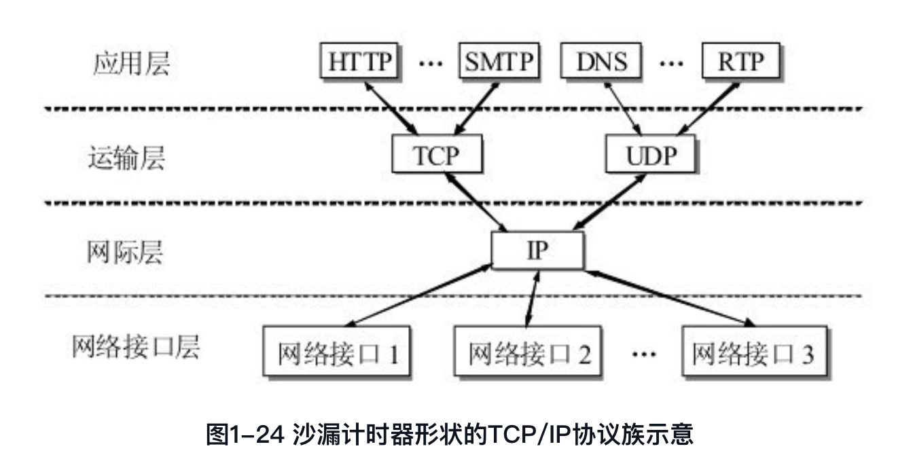  

【例1-2】 利用协议栈的概念，说明在因特网中常用的客户-服务器工作方式。【解】图1-25中的主机A和主机B都各有自己的协议栈。主机A中的应用进程（即客户进程）的位置在最高的应用层。这个客户进程向主机B应用层的服务器进程发出请求，请求建立连接（图中的❶）。然后，主机B中的服务器进程接受A的客户进程发来的请求（图中的❷）。所有这些通信，实际上都需要使用下面各层所提供的服务。但若仅仅考虑客户进程和服务器进程的交互，则可把它们之间的交互看成是如图中的水平虚线所示的那样。

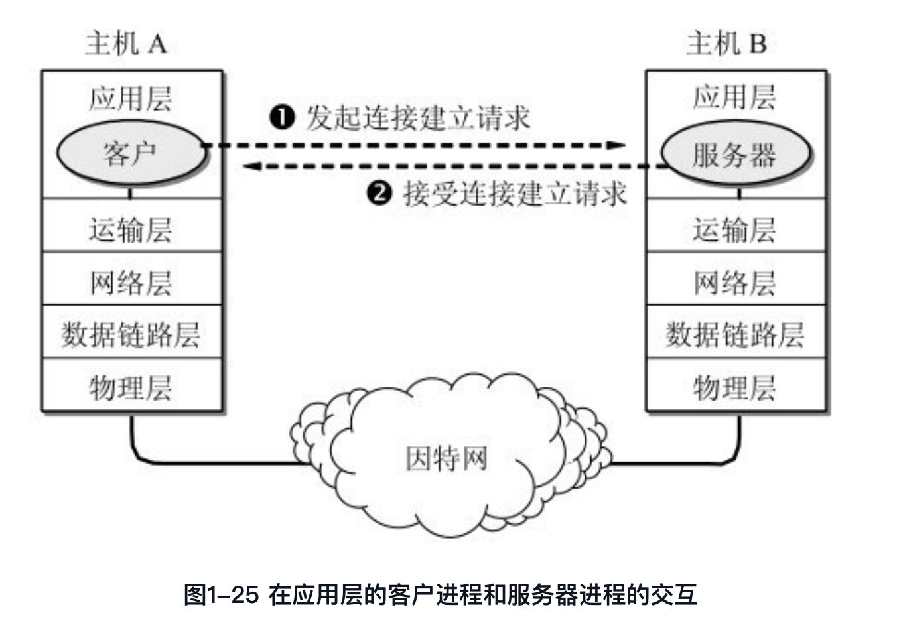  

图1-26画出了三个主机的协议栈。主机C的应用层中同时有两个服务器进程在通信。服务器1在和主机A中的客户1通信，而服务器2在和主机B中的客户2通信。有的服务器进程可以同时向几百个客户进程提供服务。

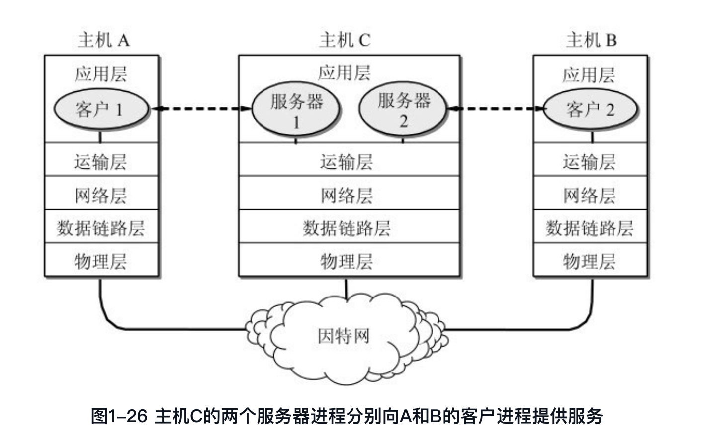  

### 1.5 本章的重要概念

-  计算机网络（可简称为网络）把许多计算机连接在一起，而互联网则把许多网络连接在一起，是网络的网络。因特网是世界上最大的互联网。
-  以小写字母i开始的internet（互联网或互连网）是通用名词，它泛指由多个计算机网络互连而成的网络。在这些网络之间的通信协议（即通信规则）可以是任意的。
-  以大写字母I开始的Internet（因特网）是专用名词，它指当前全球最大的、开放的、由众多网络相互连接而成的特定计算机网络，它采用TCP/IP协议族作为通信规则，且其前身是美国的ARPANET。
-  因特网现在采用存储转发的分组交换技术，以及三层因特网服务提供者（ISP）结构。
-  因特网按工作方式可划分为边缘部分与核心部分。主机在网络的边缘部分，其作用是进行信息处理。路由器在网络的核心部分，其作用是按存储转发方式进行分组交换。
-  计算机通信是计算机中的进程（即运行着的程序）之间的通信。计算机网络采用的通信方式是客户-服务器方式和对等连接方式（P2P方式）。
-  客户和服务器都是指通信中所涉及的两个应用进程。客户是服务请求方，服务器是服务提供方。
-  按作用范围的不同，计算机网络分为广域网WAN、城域网MAN、局域网LAN和个人区域网PAN。
-  计算机网络最常用的性能指标是：速率、带宽、吞吐量、时延（发送时延、传播时延、处理时延、排队时延）、时延带宽积、往返时间和信道（或网络）利用率。
-  网络协议即协议，是为进行网络中的数据交换而建立的规则。计算机网络的各层及其协议的集合，称为网络的体系结构。
-  五层协议的体系结构由应用层、运输层、网络层（或网际层）、数据链路层和物理层组成。运输层最重要的协议是传输控制协议TCP和用户数据报协议UDP，而网络层最重要的协议是网际协议IP。

## 2.运输层协议概述

### 2.1 进程之间的通信

从通信和信息处理的角度看，**运输层向它上面的应用层提供通信服务**，它属于面向通信部分的最高层，同时也是用户功能中的最低层。

从IP层来说，通信的两端是两个主机。两个主机进行通信就是两个主机中的**应用进程互相通信**。IP协议虽然能把分组送到目的主机，但是这个分组还停留在主机的网络层而没有交付主机中的应用进程。从运输层的角度看，**通信的真正端点并不是主机而是主机中的进程**。也就是说，**端到端的通信**是应用进程之间的通信。

运输层有一个很重要的功能——**复用**(multiplexing)和**分用**(demultiplexing)。这里的“复用”是指在发送方不同的应用进程都可以使用同一个运输层协议传送数据（当然需要加上适当的首部），而“分用”是指接收方的运输层在剥去报文的首部后能够把这些数据正确交付目的应用进程。图5-1中两个运输层之间有一个双向粗箭头，写明“**运输层提供应用进程间的逻辑通信**”。“**逻辑通信**”的意思是：从应用层来看，只要把应用层报文交给下面的运输层，运输层就可以把这报文传送到对方的运输层（那怕双方相距很远，例如几千公里），**好像这种通信就是沿水平方向直接传送数据。但事实上这两个运输层之间并没有一条水平方向的物理连接**。数据的传送是沿着图中的虚线方向（经过多个层次）传送的。“**逻辑通信**”的意思是“好像是这样通信，但事实上并非真的这样通信”。

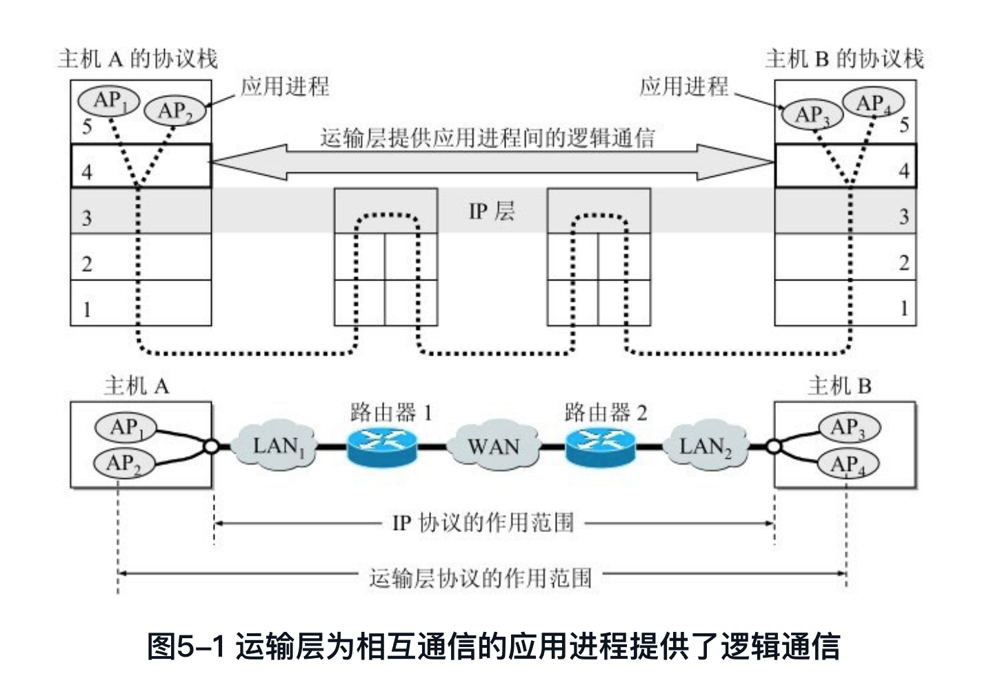  

从这里可以看出网络层和运输层有明显的区别。网络层是为主机之间提供逻辑通信，而运输层为应用进程之间提供端到端的逻辑通信（见图5-2）。然而正如后面还要讨论的，运输层还具有网络层无法代替的许多其他重要功能。运输层还要对收到的报文进行差错检测。大家应当还记得，在网络层，IP数据报首部中的检验和字段，只检验首部是否出现差错而不检查数据部分。根据应用程序的不同需求，运输层需要有两种不同的运输协议，即面向连接的TCP和无连接的UDP，这两种协议就是本章要讨论的主要内容。我们还应指出，运输层向高层用户屏蔽了下面网络核心的细节（如网络拓扑、所采用的路由选择协议等），它使应用进程看见的就是好像在两个运输层实体之间有一条端到端的逻辑通信信道，但这条逻辑通信信道对上层的表现却因运输层使用的不同协议而有很大的差别。当运输层采用面向连接的TCP协议时，尽管下面的网络是不可靠的（只提供尽最大努力服务），但这种逻辑通信信道就相当于一条全双工的可靠信道。但当运输层采用无连接的UDP协议时，这种逻辑通信信道仍然是一条不可靠信道。

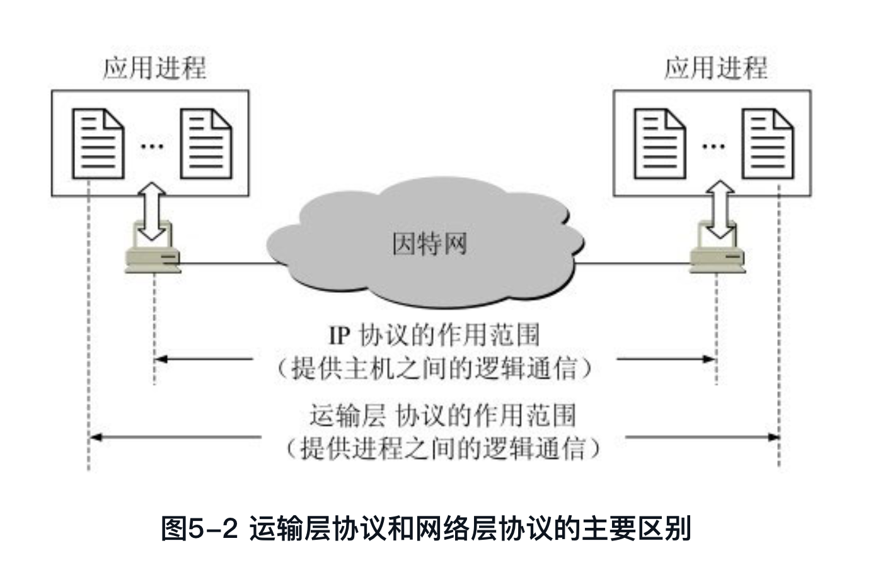  

### 2.2 运输层的两个主要协议

TCP/IP运输层的两个主要协议都是因特网的正式标准，即：

1. **用户数据报协议UDP** (User Datagram Protocol) [RFC 768]
2. **传输控制协议TCP** (Transmission Control Protocol) [RFC 793]

图5-3给出了这两种协议在协议栈中的位置。

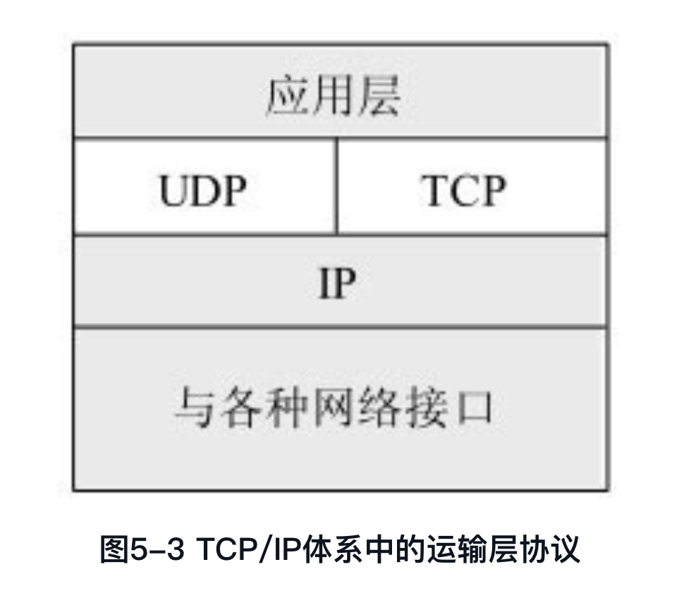  

按照OSI的术语，两个对等运输实体在通信时传送的数据单位叫作**运输协议数据单元**TPDU (Transport Protocol Data Unit)。但在TCP/IP体系中，则根据所使用的协议是TCP或UDP，分别称之为**TCP报文段**(segment) 或**UDP用户数据报**。

UDP在传送数据之前**不需要先建立连接**。远地主机的运输层在收到UDP报文后，不需要给出任何确认。虽然UDP不提供可靠交付，但在某些情况下UDP却是一种最有效的工作方式。

TCP则提供**面向连接**的服务。在传送数据之前必须先建立连接，数据传送结束后要释放连接。TCP不提供广播或多播服务。由于TCP要提供可靠的、面向连接的运输服务，因此不可避免地增加了许多的开销，如确认、流量控制、计时器以及连接管理等。这不仅使协议数据单元的首部增大很多，还要占用许多的处理机资源。表5-1给出了一些应用和应用层协议主要使用的运输层协议（UDP或TCP）。

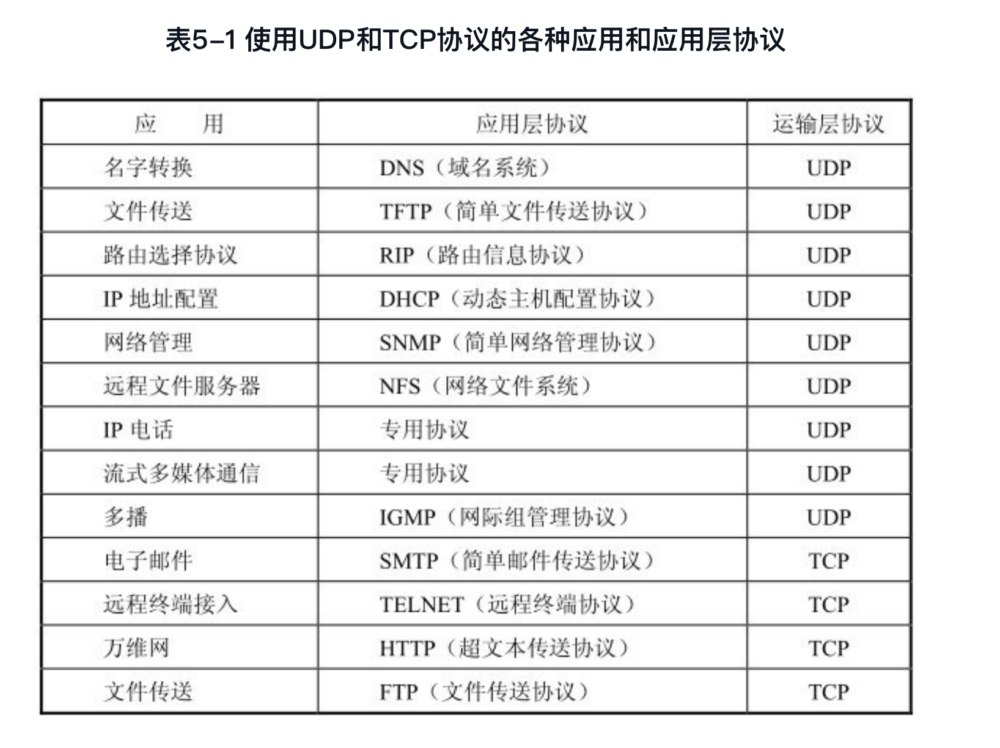

### 2.3 端口的使用

应用层所有的应用进程都可以通过运输层再传送到IP层（网络层），这就是**复用**。运输层从IP层收到数据后必须交付指明的应用进程。这就是**分用**。显然，给应用层的每个应用进程赋予一个非常明确的标志是至关重要的。

我们知道，在单个计算机中的进程是用进程标识符（一个不大的整数）来标志的。但是在因特网环境下，计算机操作系统所指派的这种进程标识符用来标志运行在应用层的各种应用进程则是不行的。这是因为在因特网上使用的计算机的操作系统种类很多，而不同的操作系统又使用不同格式的进程标识符。为了使运行不同操作系统的计算机的应用进程能够互相通信，就必须用统一的方法（而这种方法必须与特定操作系统无关）对TCP/IP体系的应用进程进行标志。

但是，把一个特定机器上运行的特定进程，指明为因特网上通信的最后的终点还是不可行的。这是因为进程的创建和撤销都是动态的，通信的一方几乎无法识别对方机器上的进程。另外，我们往往需要利用目的主机提供的功能来识别终点，而不需要知道具体实现这个功能的进程是哪一个（例如，要和因特网上的某个邮件服务器联系，并不一定要知道这个服务器功能是由目的主机上的哪个进程实现的）。

解决这个问题的方法就是在运输层使用**协议端口号**(protocol port number)，或通常简称为**端口**(port)。这就是说，虽然通信的终点是应用进程，但我们只要把要传送的报文交到目的主机的某一个合适的目的端口，剩下的工作（即最后交付目的进程）就由TCP来完成。

请注意，这种**在协议栈层间的抽象的协议端口是软件端口**，和路由器或交换机上的**硬件端口**是完全不同的概念。**硬件端口是不同硬件设备进行交互的接口**，而**软件端口是应用层的各种协议进程与运输实体进行层间交互的一种地址**。不同的系统具体实现端口的方法可以是不同的（**取决于系统使用的操作系统**）。在TCP和UDP数据报首部格式中有**源端口**和**目的端口**这两个重要字段。当运输层收到IP层交上来的运输层报文时，就能够根据其首部中的目的端口号把数据交付应用层的目的应用进程。

TCP/IP的运输层用一个16位端口号来标志一个端口。但请注意，**端口号只具有本地意义**，它只是为了标志**本计算机**应用层中的各个进程在和运输层交互时的层间接口。在因特网不同计算机中，相同的端口号是**没有关联**的。16位的端口号可允许有65 535个不同的端口号，这个数目对一个计算机来说是足够用的。

下面我们详细介绍TCP。

## 3. 传输控制协议TCP

由于TCP协议比较复杂，因此本节先对TCP协议进行一般的介绍，然后再逐步深入讨论TCP的可靠传输、流量控制和拥塞控制等问题。

### 3.1 TCP最主要的特点
TCP是TCP/IP体系中非常复杂的一个协议。下面介绍TCP最主要的特点。

1. TCP是面向连接的运输层协议。这就是说，应用程序在使用TCP协议之前，必须先建立TCP连接。在传送数据完毕后，必须释放已经建立的TCP连接。也就是说，应用进程之间的通信好像在“打电话”：通话前要先拨号建立连接，通话结束后要挂机释放连接。
2. 每一条TCP连接只能有两个端点(endpoint)，每一条TCP连接只能是点对点的（一对一）。这个问题后面还要进一步讨论。
3. TCP提供可靠交付的服务。通过TCP连接传送的数据，无差错、不丢失、不重复、并且按序到达。
4. TCP提供全双工通信。TCP允许通信双方的应用进程在任何时候都能发送数据。TCP连接的两端都设有发送缓存和接收缓存，用来临时存放双向通信的数据。在发送时，应用程序在把数据传送给TCP的缓存后，就可以做自己的事，而TCP在合适的时候把数据发送出去。在接收时，TCP把收到的数据放入缓存，上层的应用进程在合适的时候读取缓存中的数据。
5. 面向字节流。TCP中的“流”(stream)指的是流入到进程或从进程流出的字节序列。“面向字节流”的含义是：虽然应用程序和TCP的交互是一次一个数据块（大小不等），但TCP把应用程序交下来的数据看成仅仅是一连串的无结构的字节流。TCP并不知道所传送的字节流的含义。

TCP不保证接收方应用程序所收到的数据块和发送方应用程序所发出的数据块具有对应大小的关系（例如，发送方应用程序交给发送方的TCP共10个数据块，但接收方的TCP可能只用了4个数据块就把收到的字节流交付上层的应用程序）。
但接收方应用程序收到的字节流必须和发送方应用程序发出的字节流完全一样。
当然，接收方的应用程序必须有能力识别收到的字节流，把它还原成有意义的应用层数据。
图5-8是上述概念的示意图。

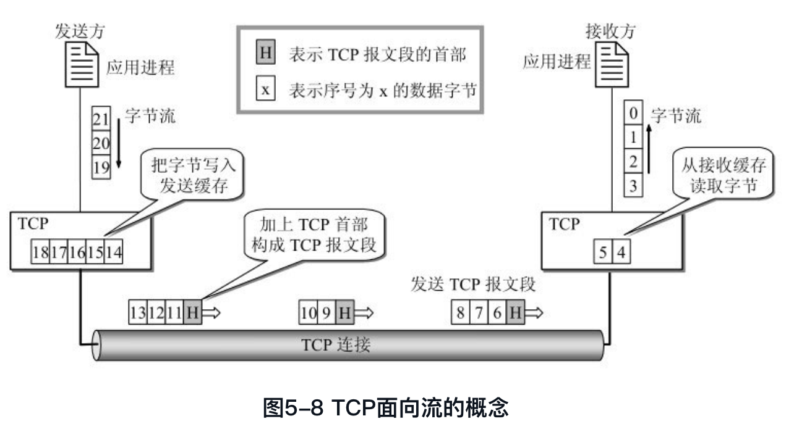  

为了突出示意图的要点，我们只画出了一个方向的数据流。但请注意，在实际的网络中，一个TCP报文段包含上千个字节是很常见的，而图中的各部分都只画出了几个字节，这仅仅是为了更方便地说明“面向字节流”的概念。另一点很重要的是：图5-8中的TCP连接是一条虚连接（也就是逻辑连接）而不是一条真正的物理连接。TCP报文段先要传送到IP层，加上IP首部后，再传送到数据链路层。再加上数据链路层的首部和尾部后，才离开主机发送到物理链路。图5-8指出，TCP和UDP在发送报文时所采用的方式完全不同。TCP并不关心应用进程一次把多长的报文发送到TCP的缓存中，而是根据对方给出的窗口值和当前网络拥塞的程度来决定一个报文段应包含多少个字节（UDP发送的报文长度是应用进程给出的）。如果应用进程传送到TCP缓存的数据块太长，TCP就可以把它划分短一些再传送。如果应用进程一次只发来一个字节，TCP也可以等待积累有足够多的字节后再构成报文段发送出去。关于TCP报文段的长度问题，在后面还要进行讨论。

### 3.2 TCP的连接

TCP把**连接**作为**最基本的抽象**。
TCP的许多特性都与TCP是面向连接的这个基本特性有关。
因此我们对TCP连接需要有更清楚的了解。

前面已经讲过，每一条TCP连接有两个端点。那么，TCP连接的端点是什么呢？不是主机，不是主机的IP地址，不是应用进程，也不是运输层的协议端口，TCP连接的端点叫做**套接字**(socket)或**插口**。根据RFC 793的定义：**端口号**拼接到(contatenated with) IP地址即构成了套接字。因此，套接字的表示方法是在点分十进制的IP地址后面写上端口号，中间用冒号或逗号隔开。例如，若IP地址是192.3.4.5而端口号是80，那么得到的套接字就是(192.3.4.5: 80)。总之，我们有

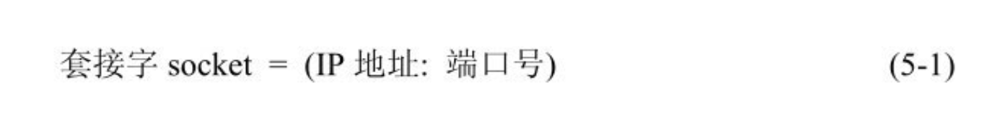  

**每一条TCP连接唯一地被通信两端的两个端点（即两个套接字）所确定**。即：

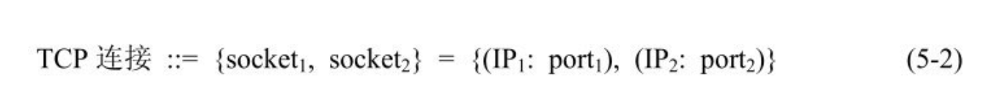  

这里IP1和IP2分别是两个端点主机的IP地址，而port1和port2分别是两个端点主机中的端口号。TCP连接的两个套接字就是socket1和socket2。可见套接字socket是个很抽象的概念。

总之，TCP连接就是由协议软件所提供的一种抽象。虽然有时为了方便，我们也可以说，在一个应用进程和另一个应用进程之间建立了一条TCP连接，但一定要记住：**TCP 连接的端点是个很抽象的套接字，即（IP 地址：端口号）**。也还应记住：同一个IP地址可以有多个不同的TCP连接，而同一个端口号也可以出现在多个不同的TCP连接中。

请注意，socket这个名词有时容易使人把一些概念弄混淆，因为随着因特网的不断发展，以及网络技术的进步，**同一个名词socket却可表示多种不同的意思**。
例如：

1. 允许应用程序访问连网协议的应用编程接口API (Application ProgrammingInterface)，即运输层和应用层之间的一种接口，称为socket API, 并简称为socket。
2. 在socket API中使用的一个函数名也叫作socket。
3. 调用socket函数的端点称为socket，如“创建一个数据报socket”。
4. 调用socket函数时，其返回值称为socket描述符，可简称为socket。
5. 在操作系统内核中连网协议的Berkeley实现，称为socket实现。

上面的这些socket的意思都和本章所引用的RFC 793定义的socket（指端口号拼接到IP地址）不同。请读者加以注意。

## 4. 可靠传输的工作原理

我们知道，TCP发送的报文段是交给IP层传送的。但IP层只能提供尽最大努力服务，也就是说，TCP下面的网络所提供的是不可靠的传输。因此，TCP必须采用适当的措施才能使得两个运输层之间的通信变得可靠。理想的传输条件有以下两个特点：

1. 传输信道不产生差错。
2. 不管发送方以多快的速度发送数据，接收方总是来得及处理收到的数据。

在这样的理想传输条件下，不需要采取任何措施就能够实现可靠传输。然而实际的网络都不具备以上两个理想条件。但我们可以使用一些可靠传输协议，当出现差错时让发送方重传出现差错的数据，同时在接收方来不及处理收到的数据时，及时告诉发送方适当降低发送数据的速度。这样一来，本来是不可靠的传输信道就能够实现可靠传输了。下面从最简单的停止等待协议讲起

这里省略以下小节内容：
- 4.1 停止等待协议
  - 4.1.1无差错情况
  - 4.1.2出现差错
  - 4.1.3确认丢失和确认迟到
  - 4.1.4信道利用率
- 4.2 连续ARQ协议

读者若想详细了解以上内容可以查阅 [《计算机网络》（第6版）谢希仁编著](https://book.douban.com/subject/24740558/) 第5章。
在深入讨论TCP的可靠传输问题之前，必须先了解TCP的报文段首部的格式。这才是我们的重点。

### 4.3 TCP报文段的首部格式

TCP虽然是**面向字节流**的，但TCP传送的**数据单元**却是**报文段**。一个TCP报文段分为**首部**和**数据**两部分，而**TCP的全部功能都体现在它首部中各字段的作用**。因此，只有弄清TCP首部各字段的作用才能掌握TCP的工作原理。下面就讨论TCP报文段的首部格式。

TCP报文段首部的前20个字节是固定的（图5-14），后面有4n字节是根据需要而增加的选项(n是整数)。因此TCP首部的最小长度是20字节。

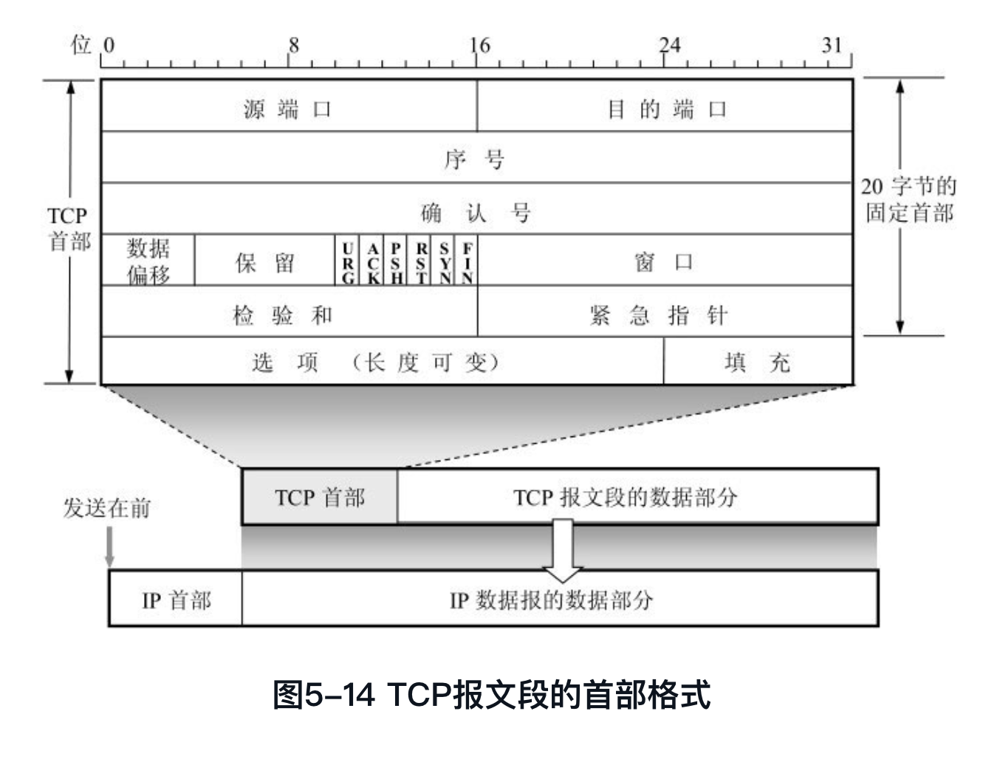  

首部固定部分各字段的意义如下：

#### (1) **源端口**和**目的端口**

各占2个字节，分别写入源端口号和目的端口号。和UDP的分用相似，TCP的分用功能也是通过端口实现的。

#### (2) **序号**

占4字节。序号范围是[0, 2^32 - 1]，共2^32（即4 294 967 296）个序号。序号增加到2^32 - 1后，下一个序号就又回到0。也就是说，序号使用mod 2^32运算。TCP是面向字节流的。在一个TCP连接中传送的字节流中的**每一个字节都按顺序编号**。整个要传送的字节流的起始序号必须在连接建立时设置。首部中的序号字段值则指的是**本报文段**所发送的数据的第一个字节的序号。例如，一报文段的序号字段值是301，而携带的数据共有100字节。这就表明：本报文段的数据的第一个字节的序号是301，最后一个字节的序号是400。显然，下一个报文段（如果还有的话）的数据序号应当从401开始，即下一个报文段的序号字段值应为401。这个字段的名称也叫做“**报文段序号**”。

#### (3) **确认号** 
占4字节，是**期望收到对方下一个报文段的第一个数据字节的序号**。例如，B正确收到了A发送过来的一个报文段，其序号字段值是501，而数据长度是200字节（序号501～700），这表明B正确收到了A发送的到序号700为止的数据。因此，B期望收到A的下一个数据序号是701，于是B在发送给A的确认报文段中把确认号置为701。请注意，现在的确认号不是501，也不是700，而是701。总之，应当记住：

```txt
若确认号 = N，则表明：到序号N - 1为止的所有数据都已正确收到。
```

由于序号字段有32位长，可对4 GB（即4千兆字节）的数据进行编号。在一般情况下可保证当序号重复使用时，旧序号的数据早已通过网络到达终点了。

#### (5) **数据偏移** 

占4位，它指出TCP报文段的数据起始处距离TCP报文段的起始处有多远。这个字段实际上是指出TCP报文段的首部长度。由于首部中还有长度不确定的选项字段，因此数据偏移字段是必要的。但应注意，“数据偏移”的单位是32位字（即以4字节长的字为计算单位）。由于4位二进制数能够表示的最大十进制数字是15，因此数据偏移的最大值是60字节，这也是TCP首部的最大长度（即选项长度不能超过40字节）。
#### (6) **保留** 
占6位，保留为今后使用，但目前应置为0。下面有6个控制位说明本报文段的性质，它们的意义见下面的(7)～(12)。

#### (7) **紧急URG** (URGent) 

当URG = 1时，表明紧急指针字段有效。它告诉系统此报文段中有紧急数据，应尽快传送(相当于高优先级的数据)，而不要按原来的排队顺序来传送。例如，已经发送了很长的一个程序要在远地的主机上运行。但后来发现了一些问题，需要取消该程序的运行。因此用户从键盘发出中断命令（Control +C）。如果不使用紧急数据，那么这两个字符将存储在接收TCP的缓存末尾。只有在所有的数据被处理完毕后这两个字符才被交付接收方的应用进程。这样做就浪费了许多时间。

当URG置1时，发送应用进程就告诉发送方的TCP有紧急数据要传送。于是发送方TCP就把紧急数据插入到本报文段数据的最前面，而在紧急数据后面的数据仍是普通数据。这时要与首部中紧急指针(Urgent Pointer)字段配合使用。

#### (8) **确认ACK** (ACKnowlegment) 

仅当ACK = 1时确认号字段才有效。当ACK = 0时，确认号无效。TCP规定，在连接建立后所有传送的报文段都必须把ACK置1。

#### (9) **推送 PSH** (PuSH)

当两个应用进程进行交互式的通信时，有时在一端的应用进程希望在键入一个命令后立即就能够收到对方的响应。在这种情况下，TCP就可以使用推送(push)操作。这时，发送方TCP把PSH置1，并立即创建一个报文段发送出去。接收方TCP收到PSH = 1的报文段，就尽快地（即“推送”向前）交付接收应用进程，而不再等到整个缓存都填满了后再向上交付。虽然应用程序可以选择推送操作，但推送操作还很少使用。

#### (10) **复位RST** (ReSeT)

当RST = 1时，表明TCP连接中出现严重差错（如由于主机崩溃或其他原因），必须释放连接，然后再重新建立运输连接。RST置1还用来拒绝一个非法的报文段或拒绝打开一个连接。RST也可称为重建位或重置位。

#### (11) **同步SYN** (SYNchronization) 

在连接建立时用来同步序号。当SYN = 1而ACK= 0时，表明这是一个连接请求报文段。对方若同意建立连接，则应在响应的报文段中使SYN = 1和ACK = 1。因此，SYN置为1就表示这是一个连接请求或连接接受报文。关于连接的建立和释放，在本章的5.9节还要进行详细讨论。

#### (12) **终止FIN** (FINis，意思是“完”、“终”) 

用来释放一个连接。当FIN = 1时，表明此报文段的发送方的数据已发送完毕，并要求释放运输连接。

#### (13) **窗口** 

占2字节。窗口值是[0, 216 - 1]之间的整数。窗口指的是发送本报文段的一方的接收窗口（而不是自己的发送窗口）。窗口值告诉对方：从本报文段首部中的确认号算起，接收方目前允许对方发送的数据量。之所以要有这个限制，是因为接收方的数据缓存空间是有限的。总之，窗口值作为接收方让发送方设置其发送窗口的依据。例如，设确认号是701，窗口字段是1000。这就表明，从701号算起，发送此报文段的一方还有接收1000个字节数据（字节序号是701～1 700）的接收缓存空间。总之，应当记住：

```txt
窗口字段明确指出了现在允许对方发送的数据量。窗口值是经常在动态变化着。
```

#### (14) **检验和** 

占2字节。检验和字段检验的范围包括首部和数据这两部分。和UDP用户数据报一样，在计算检验和时，要在TCP报文段的前面加上12字节的伪首部。伪首部的格式与图5-5中UDP用户数据报的伪首部一样。但应把伪首部第4个字段中的17改为6 （TCP的协议号是6），把第5字段中的UDP长度改为TCP长度。接收方收到此报文段后，仍要加上这个伪首部来计算检验和。若使用IPv6，则相应的伪首部也要改变。

#### (15) **紧急指针** 

占2字节。紧急指针仅在URG = 1时才有意义，它指出本报文段中的紧急数据的字节数（紧急数据结束后就是普通数据）。因此，紧急指针指出了紧急数据的末尾在报文段中的位置。当所有紧急数据都处理完时，TCP就告诉应用程序恢复到正常操作。值得注意的是，即使窗口为零时也可发送紧急数据。

#### (16) **选项** 

长度可变，最长可达40字节。当没有使用“选项”时，TCP的首部长度是20字节。

TCP最初只规定了一种选项，即**最大报文段长度 MSS** (Maximum Segment Size)[RFC 879]。请注意MSS这个名词的含义。MSS是每一个TCP报文段中的数据字段的最大长度。数据字段加上TCP首部才等于整个的TCP报文段。所以MSS并不是整个TCP报文段的最大长度，而是“TCP报文段长度减去TCP首部长度”。

为什么要规定一个最大报文段长度MSS呢？这并不是考虑接收方的接收缓存可能放不下TCP报文段中的数据。实际上，MSS与接收窗口值没有关系。我们知道，TCP报文段的数据部分，至少要加上40字节的首部（TCP首部20字节和IP首部20字节，这里都还没有考虑首部中的选项部分），才能组装成一个IP数据报。若选择较小的MSS长度，网络的利用率就降低。设想在极端的情况下，当TCP报文段只含有1字节的数据时，在IP层传输的数据报的开销至少有40字节(包括TCP报文段的首部和IP数据报的首部)。这样，对网络的利用率就不会超过1/41。到了数据链路层还要加上一些开销。但反过来，若TCP报文段非常长，那么在IP层传输时就有可能要分解成多个短数据报片。在终点要把收到的各个短数据报片装配成原来的TCP报文段。当传输出错时还要进行重传。这些也都会使开销增大。

因此，MSS应尽可能大些，只要在IP层传输时不需要再分片就行。由于IP数据报所经历的路径是动态变化的，因此在这条路径上确定的不需要分片的MSS，如果改走另一条路径就可能需要进行分片。因此最佳的MSS是很难确定的。在连接建立的过程中，双方都把自己能够支持的MSS写入这一字段，以后就按照这个数值传送数据，两个传送方向可以有不同的MSS值。若主机未填写这一项，则MSS的默认值是536字节长。因此，所有在因特网上的主机都应能接受的报文段长度是536 +20（固定首部长度）= 556字节。

随着因特网的发展，又陆续增加了几个选项。如**窗口扩大选项**、**时间戳选项**等[RFC1323]。以后又增加了有关选择确认(SACK)选项[RFC 2018]。这些选项的位置都在图5-14所示的“选项”字段中。

窗口扩大选项是为了扩大窗口。我们知道，TCP首部中窗口字段长度是16位，因此最大的窗口大小为64 K字节（见下一节）。虽然这对早期的网络是足够用的，但对于包含卫星信道的网络，传播时延和带宽都很大，要获得高吞吐率需要更大的窗口大小。

窗口扩大选项占3字节，其中有一个字节表示移位值 S。新的窗口值等于TCP首部中的窗口位数从16增大到(16 + S)。移位值允许使用的最大值是14，相当于窗口最大值增大到2(16 + 14) - 1 = 230 - 1。

窗口扩大选项可以在双方初始建立TCP连接时进行协商。如果连接的某一端实现了窗口扩大，当它不再需要扩大其窗口时，可发送S = 0的选项，使窗口大小回到16。

**时间戳**选项占10字节，其中最主要的字段**时间戳值字段**（4字节）和**时间戳回送回答字段**（4字节）。时间戳选项有以下两个功能：

第一，用来计算往返时间RTT（见本章5.6.3节）。发送方在发送报文段时把当前时钟的时间值放入时间戳字段，接收方在确认该报文段时把时间戳字段值复制到时间戳回送回答字段。因此，发送方在收到确认报文后，可以准确地计算出RTT来。

第二，用于处理TCP序号超过232的情况，这又称为**防止序号绕回** PAWS (ProtectAgainst Wrapped Sequence numbers)。我们知道，序号只有32位，而每增加232个序号就会重复使用原来用过的序号。当使用高速网络时，在一次TCP连接的数据传送中序号很可能会被重复使用。例如，若用1Gb/s的速率发送报文段，则不到35秒钟数据字节的序号就会重复。为了使接收方能够把新的报文段和迟到很久的报文段区分开，可以在报文段中加上这种时间戳。选择确认选项，我们将在本章稍后小节中介绍。

## 5. TCP可靠传输的实现

本节讨论TCP可靠传输的实现。

我们首先介绍以字节为单位的滑动窗口。为了讲述可靠传输原理的方便，我们假定数据传输只在一个方向进行，即A发送数据，B给出确认。这样的好处是使讨论限于两个窗口，即发送方A的发送窗口和接收方B的接收窗口。如果再考虑B也向A发送数据，那么还要增加A的接收窗口和B的发送窗口，这对讲述可靠传输的原理并没有多少帮助，反而会使问题更加繁琐。

### 5.1 以字节为单位的滑动窗口

**TCP的滑动窗口是以字节为单位的**。为了便于说明，我们故意把后面图5-15至图5-18中的字节编号都取得很小。

#### 示例1

现假定 A 收到了 B **发来**的确认报文段，其中窗口是20（字节），而确认号是31（这表明B期望收到的下一个序号是31，而序号30为止的数据已经收到了）。根据这两个数据，A就构造出自己的**发送窗口**，其位置如图5-15所示。

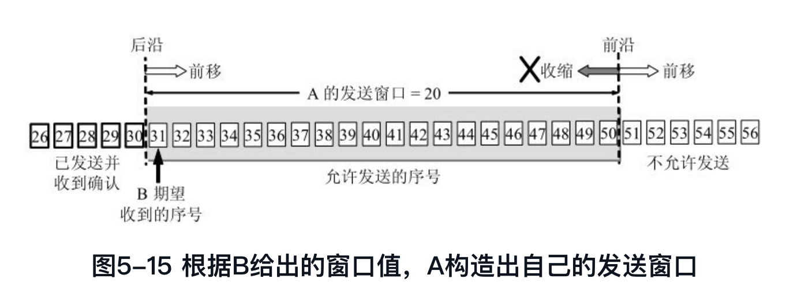  

我们先讨论发送方A的发送窗口。**发送窗口**表示：在没有收到B的确认的情况下，A可以连续把窗口内的数据都发送出去。凡是已经发送过的数据，在未收到确认之前都必须暂时保留，以便在**超时重传**时使用。

发送窗口里面的序号表示允许发送的序号。显然，窗口越大，发送方就可以在收到对方确认之前连续发送更多的数据，因而可能获得更高的传输效率。但接收方必须来得及处理这些收到的数据。

发送窗口后沿的后面部分表示已发送且已收到了确认。这些数据显然不需要再保留了。而发送窗口前沿的前面部分表示不允许发送的，因为接收方都没有为这部分数据保留临时存放的**缓存空间**。

发送窗口的位置由窗口前沿和后沿的位置共同确定。发送窗口后沿的变化情况有两种可能，即不动（没有收到新的确认）和前移（收到了新的确认）。发送窗口后沿不可能向后移动，因为不能撤销掉已收到的确认。发送窗口前沿通常是不断向前移动，但也有可能不动。这对应于两种情况：一是没有收到新的确认，对方通知的窗口大小也不变；二是收到了新的确认但对方通知的窗口缩小了，使得发送窗口前沿正好不动。

发送窗口前沿也有可能向后**收缩**。这发生在对方通知的窗口缩小了。但TCP的标准强烈不赞成这样做。因为很可能发送方在收到这个通知以前已经发送了窗口中的许多数据，现在又要收缩窗口，不让发送这些数据，这样就会产生一些错误。

#### 示例2

现在假定A发送了序号为31～41的数据。这时，发送窗口位置并未改变（图5-16），但发送窗口内靠后面有11个字节（灰色小方框表示）表示已发送但未收到确认。而发送窗口内靠前面的9个字节（42～50）是允许发送但尚未发送的。

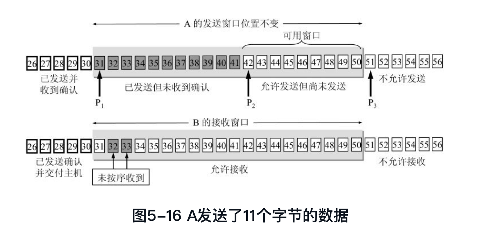  

从以上所述可以看出，要描述一个发送窗口的状态需要三个指针：P1，P2和P3（图5-16）。指针都指向字节的序号。这三个指针指向的几个部分的意义如下：小于P1的是已发送并已收到确认的部分，而大于P3的是不允许发送的部分。

P3 - P1 = A的发送窗口（又称为通知窗口）

P2 - P1 = 已发送但尚未收到确认的字节数

P3 - P2 = 允许发送但尚未发送的字节数（又称为**可用窗口**或**有效窗口**）

再看一下B的接收窗口。B的接收窗口大小是20。在接收窗口外面，到30号为止的数据是已经发送过确认，并且已经交付主机了。因此在B可以不再保留这些数据。接收窗口内的序号（31～50）是允许接收的。在图5-16中，B收到了序号为32和33的数据。这些数据没有**按序到达**，因为序号为31的数据没有收到（也许丢失了，也许滞留在网络中的某处）。请注意，B只能对**按序收到**的数据中的最高序号给出确认，因此B发送的确认报文段中的确认号仍然是31（即期望收到的序号），而不能是32或33。

#### 示例3

现在假定B收到了序号为31的数据，并把序号为31～33的数据交付主机，然后B删除这些数据。接着把接收窗口向前移动3个序号（图5-17），同时给A发送确认，其中窗口值仍为20，但确认号是34。这表明B已经收到了到序号33为止的数据。我们注意到，B还收到了序号为37, 38和40的数据，但这些都没有按序到达，只能先暂存在接收窗口中。A收到B的确认后，就可以把发送窗口向前滑动3个序号，但指针P2不动。可以看出，现在A的可用窗口增大了，可发送的序号范围是42～53。

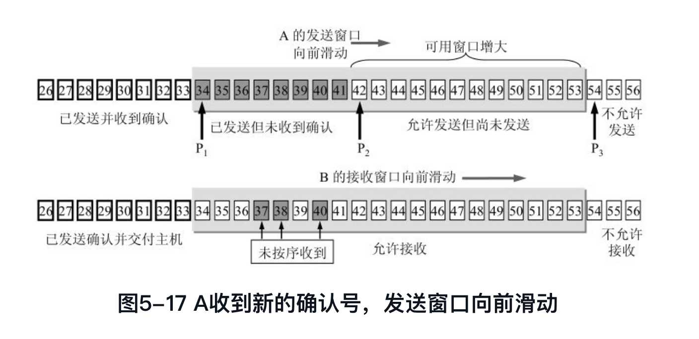  

A在继续发送完序号42～53的数据后，指针P2向前移动和P3重合。发送窗口内的序号都已用完，但还没有再收到确认（图5-18）。由于A的发送窗口已满，可用窗口已减小到零，因此必须停止发送。请注意，存在下面这种可能性，就是发送窗口内所有的数据都已正确到达B，B也早已发出了确认。但不幸的是，所有这些确认都滞留在网络中。在没有收到B的确认时，A不能猜测：“或许B收到了吧！”为了保证可靠传输，A只能认为B还没有收到这些数据。于是，A在经过一段时间后（由超时计时器控制）就重传这部分数据，重新设置超时计时器，直到收到B的确认为止。如果A收到确认号落在发送窗口内，那么A就可以使发送窗口继续向前滑动，并发送新的数据。

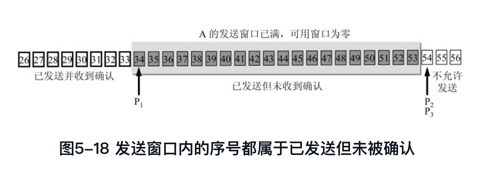  

我们在前面的图5-8中曾给出了这样的概念：**发送方的应用进程把字节流写入TCP的发送缓存，接收方的应用进程从TCP的接收缓存中读取字节流**。

下面我们就进一步讨论前面讲的窗口和缓存的关系。图5-19画出了发送方维持的发送缓存和发送窗口，以及接收方维持的接收缓存和接收窗口。这里首先要明确两点：

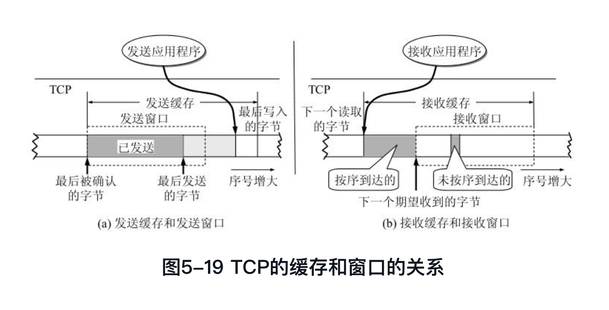  

第一，缓存空间和序号空间都是有限的，并且都是循环使用的。最好是把它们画成圆环状的。但这里为了画图的方便，我们还是把它们画成长条状的，同时也不考虑循环使用缓存空间和序号空间的问题。

第二，由于实际上缓存或窗口中的字节数是非常之大的，因此无法在图中把一个个字节的位置标注清楚。这样，图中的一些指针也无法准确画成指向某一字节的位置。但这并不妨碍用这种表示来说明缓存和窗口的关系。

我们先看一下图5-19(a)所示的发送方的情况。发送缓存用来暂时存放：

(1) 发送应用程序传送给发送方TCP准备发送的数据；

(2) TCP已发送出但尚未收到确认的数据。

发送窗口通常只是发送缓存的一部分。已被确认的数据应当从发送缓存中删除，因此发送缓存和发送窗口的后沿是重合的。发送应用程序最后写入发送缓存的字节减去最后被确认的字节，就是还保留在发送缓存中的被写入的字节数。发送应用程序必须控制写入缓存的速率，不能太快，否则发送缓存就会没有存放数据的空间。

再看一下图5-19(b)所示的接收方的情况。接收缓存用来暂时存放：

(1) 按序到达的、但尚未被接收应用程序读取的数据；

(2) 未按序到达的数据。

如果收到的分组被检测出有差错，则要丢弃。如果接收应用程序来不及读取收到的数据，接收缓存最终就会被填满，使接收窗口减小到零。反之，如果接收应用程序能够及时从接收缓存中读取收到的数据，接收窗口就可以增大，但最大不能超过接收缓存的大小。图5-19(b)中还指出了下一个期望收到的字节号。这个字节号也就是接收方给发送方的报文段的首部中的确认号。

根据以上所讨论的，我们还要再强调以下三点。

第一，虽然A的发送窗口是根据B的接收窗口设置的，但在同一时刻，A的发送窗口并不总是和B的接收窗口一样大。这是因为通过网络传送窗口值需要经历一定的时间滞后（这个时间还是不确定的）。另外，正如本章稍后将要讲到的，发送方A还可能根据网络当时的**拥塞**情况适当减小自己的发送窗口数值。

第二，对于不按序到达的数据应如何处理，TCP标准并无明确规定。如果接收方把不按序到达的数据一律丢弃，那么接收窗口的管理将会比较简单，但这样做对网络资源的利用不利（因为发送方会重复传送较多的数据）。因此TCP通常对不按序到达的数据是先临时存放在接收窗口中，等到字节流中所缺少的字节收到后，再**按序交付上层的应用进程**。

第三，TCP要求接收方必须有累积确认的功能，这样可以减小传输开销。接收方可以在合适的时候发送确认，也可以在自己有数据要发送时把确认信息顺便**捎带**上。但请注意两点，一是接收方不应过分推迟发送确认，否则会导致发送方不必要的重传，这反而浪费了网络的资源。TCP标准规定，确认推迟的时间不应超过0.5秒。若收到一连串具有最大长度的报文段，则必须每隔一个报文段就要发送一个确认[RFC 1122]。

### 5.2 超时重传时间的选择


运输层的超时计时器的超时重传时间究竟应设置为多大呢？

TCP采用了一种自适应算法，它记录一个报文段发出的时间，以及收到相应的确认的时间。这两个时间之差就是**报文段的往返时间RTT**。TCP保留了RTT的一个加权平均往返时间 RTTS（这又称为平滑的往返时间，S表示Smoothed。因为进行的是加权平均，因此得出的结果更加平滑）。每当第一次测量到RTT样本时，RTTS值就取为所测量到的RTT样本值。但以后每测量到一个新的RTT样本，就按下式重新计算一次RTTS：

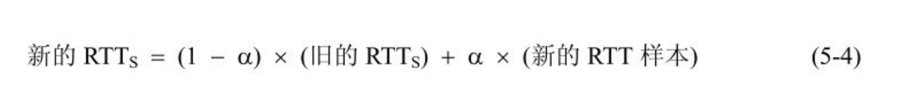  


在上式中，0 ≤ α < 1。若 α很接近于零，表示新的RTTS值和旧的RTTS值相比变化不大，而对新的RTT样本影响不大(RTT值更新较慢)。若选择 α接近于1，则表示新的RTTS值受新的RTT样本的影响较大(RTT值更新较快)。RFC 2988推荐的α值为1/8，即0.125。用这种方法得出的加权平均往返时间RTTS就比测量出的RTT值更加平滑。

显然，超时计时器设置的**超时重传时间** RTO (RetransmissionTime-Out)应略大于上面得出的加权平均往返时间RTTS。RFC 2988建议使用下式计算RTO：

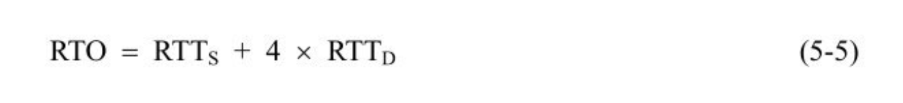  

而RTTD是RTT的**偏差**的加权平均值，它与RTTS和新的RTT样本之差有关。RFC2988建议这样计算RTTD。当第一次测量时，RTTD值取为测量到的RTT样本值的一半。在以后的测量中，则使用下式计算加权平均的RTTD：

  

这里 β 是个小于1的系数，它的推荐值是1/4，即0.25。

> 以下三段行文是对原文做了删减得到的。

现在的问题是：**如何判定此确认报文段是对先发送的报文段的确认，还是对后来重传的报文段的确认**？针对这个问题 Karn 提出了一个算法：**在计算加权平均RTTS时，只要报文段重传了，就不采用其往返时间样本**。这样得出的加权平均RTTS和RTO就较准确。

对Karn算法进行修正。方法是：报文段每重传一次，就把超时重传时间RTO增大一些。典型的做法是取新的重传时间为2倍的旧的重传时间。当不再发生报文段的重传时，才根据上面给出的(5-5)式计算超时重传时间。**实践证明，这种策略较为合理**。

总之，**Karn算法能够使运输层区分开有效的和无效的往返时间样本，从而改进了往返时间的估测**。

