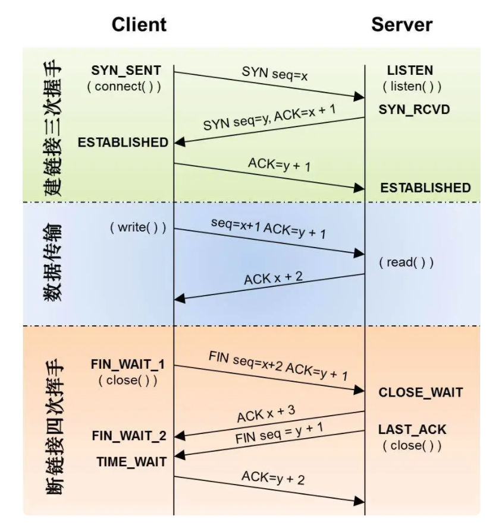
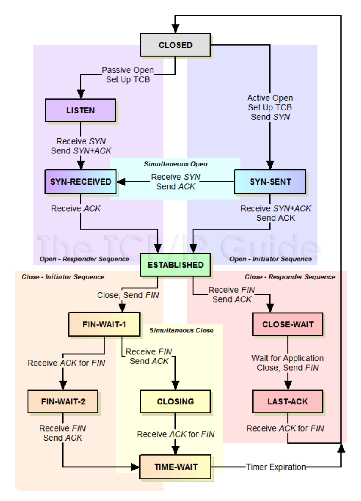
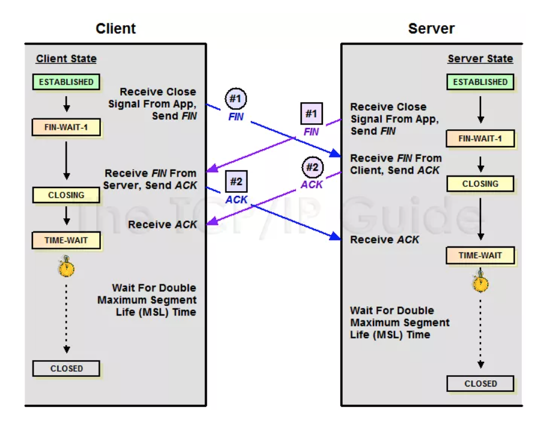
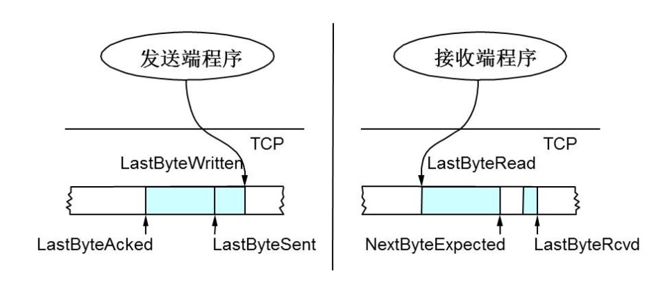

> 注意⚠️：
> 
> 阅读本文前应对TCP的基本知识有所了解。
> 建议详细阅读完《计算机网络（第6版）》谢希仁编著 第五章内容后再阅读本文。

大纲：
1. 历史
2. 解决什么问题
3. 怎么实现
4. 怎么应用
5. 有什么问题
6. 怎么结局问题

## 核心资料
- https://www.rfc-editor.org/

- RFC793 Transmission Control Protocol, SEPTEMBER 1981 
  - 规定ISN相关信息 
  - [Information on RFC 793 » RFC Editor](https://www.rfc-editor.org/info/rfc793)

## 引用资料

- [为什么 TCP 建立连接需要三次握手](https://mp.weixin.qq.com/s/XGpIjrnxAAuHa8EVSotBQw)
- [彻底弄懂TCP协议：从三次握手说起](https://mp.weixin.qq.com/s/6LiZGMt2KRiIoMaLwx-lkQ)

## 关键术语

- socket
- TCP 
- IP
- SEQ
- ACK
- SYN
- ISN
- SYN Flood
- **`FIN`**
- MSL
- SACK : Selective Acknowledgment
- D-SACK : 
- Slid Window: 滑动窗口 

## 定义 “连接”

各种资料总是说 TCP 是面向连接的，那么问题来了：什么是连接？

不要再看二手知识的各种类比解释，直接看原文：

The reliability and flow control mechanisms described above require that TCPs initialize and maintain certain status information for each data stream. The combination of this information, including sockets, sequence numbers, and window sizes, is called a connection.

上面👆这段这是出自：[Information on RFC 793 » RFC Editor](https://www.rfc-editor.org/info/rfc793)

英文读不懂？
谷歌翻译：上述可靠性和流控制机制要求TCP初始化并维护每个数据流的某些状态信息。此信息的组合，包括套接字，序列号和窗口大小，称为连接。
笔者翻译： 在不可靠传输的IP层之上建立可靠传输和流控制机制需要维护的状态信息的集合称为连接。这些状态信息包括套接字，序列号和窗口大小等。

## 图解TCP 的三次握手、四次挥手

  
> 图片来自互联网

 
> 图片来自互联网 

## 为什么需要 “三次握手” 两次不行吗？

在RFC0793里有下面两段话：

The principle reason for the three-way handshake is to prevent old duplicate connection initiations from causing confusion.

A three way handshake is necessary because sequence numbers are not tied to a global clock in the network, and TCPs may have different mechanisms for picking the ISN's. The receiver of the first SYN has no way of knowing whether the segment was an old delayed one or not, unless it remembers the last sequence number used on the connection (which is not always possible), and so it must ask the sender to verify this SYN. The three way handshake and the advantages of a clock-driven scheme are discussed in.

总结来说：

- 三次通信才能够在发送端有足够的上下文信息决定是否建立连接。
- 三次通信能够完成 同步序号和确认序号信息的交换。
- 三次通信是建立可靠连接所需要的最少次数，换句话说，次数多了可以少了不行。

## TCP 连接的初始化序列号能否固定？

如果初始化序列号（缩写为 ISN：Inital Sequence Number）可以固定，我们来看看会出现什么问题。

假设 ISN 固定是 1，*Client* 和 *Server* 建立好一条 TCP 连接后，*Client* 连续给 *Server* 发了 10 个包，这 10 个包不知怎么被链路上的路由器缓存了(路由器会毫无先兆地缓存或者丢弃任何的数据包)，
这个时候碰巧 *Client* 挂掉了，然后 *Client* 用同样的端口号重新连上 *Server*，
*Client* 又连续给 *Server* 发了几个包，假设这个时候 *Client* 的序列号变成了 5。

接着，之前被路由器缓存的 10 个数据包全部被路由到 *Server* 端了，
*Server* 给 *Client* 回复确认号 10，这个时候，
*Client* 整个都不好了，这是什么情况？我的序列号才到 5，你怎么给我的确认号是 10 了，整个都乱了。

RFC793 中，建议 ISN 和一个假的时钟绑在一起，
这个时钟会在每 4 微秒对 ISN 做加一操作，直到超过 2^32，
又从 0 开始，这需要 4 小时才会产生 ISN 的回绕问题，
这几乎可以保证每个新连接的 ISN 不会和旧的连接的 ISN 产生冲突。

这种递增方式的 ISN，很容易让攻击者猜测到 TCP 连接的 ISN，
现在的实现大多是在一个基准值的基础上进行随机的。

## 初始化连接的 SYN 超时问题

*Client* 发送 SYN 包给 *Server* 后挂了，*Server* 回给 *Client* 的 **`SYN-ACK`** 一直没收到 *Client* 的 ACK 确认，
这个时候这个连接既没建立起来，也不能算失败。

这就需要一个超时时间让 *Server* 将这个连接断开，
否则这个连接就会一直占用 *Server* 的 SYN 连接队列中的一个位置，
大量这样的连接就会将 *Server* 的 SYN 连接队列耗尽，
让正常的连接无法得到处理。

目前，Linux 下默认会进行 5 次重发 **`SYN-ACK`** 包，
重试的间隔时间从 1s 开始，下次的重试间隔时间是前一次的双倍，
5 次的重试时间间隔为 1s,2s, 4s, 8s,16s，总共 31s，
第 5 次发出后还要等 32s 都知道第 5 次也超时了，
所以，总共需要 1s + 2s +4s+ 8s+ 16s + 32s =63s，
TCP 才会把断开这个连接。

由于，SYN 超时需要 63 秒，那么就给攻击者一个攻击服务器的机会，
攻击者在短时间内发送大量的 SYN 包给 *Server*(俗称 SYN flood 攻击)，用于耗尽 *Server* 的 SYN 队列。

对于应对 SYN 过多的问题，linux 提供了几个 TCP 参数：

- `tcp_syncookies`
- `tcp_synack_retries`
- `tcp_max_syn_backlog`
- `tcp_abort_on_overflow`

来调整应对。

## TCP 的 Peer 两端同时断开连接
由上面的”TCP 协议状态机“图可以看出，
TCP 的 Peer 端在收到对端的 **`FIN`** 包前发出了 **`FIN`** 包，
那么该 Peer 的状态就变成了 **`FIN_WAIT1`**，
Peer 在 **`FIN_WAIT1`** 状态下收到对端 Peer 对自己 **`FIN`** 包的 ACK 包的话，
那么 Peer 状态就变成 FIN_WAIT2，Peer 在 FIN_WAIT2 下收到对端 Peer 的 **`FIN`** 包，
在确认已经收到了对端 Peer 全部的 Data 数据包后，
就响应一个 ACK 给对端 Peer，然后自己进入 **`TIME_WAIT`** 状态。

但是如果 Peer 在 **`FIN_WAIT1`** 状态下首先收到对端 Peer 的 **`FIN`** 包的话，
那么该 Peer 在确认已经收到了对端 Peer 全部的 Data 数据包后，
就响应一个 ACK 给对端 Peer，然后自己进入 CLOSEING 状态，
Peer 在 CLOSEING 状态下收到自己的 **`FIN`** 包的 ACK 包的话，
那么就进入 TIME WAIT 状态。
于是，TCP 的 Peer 两端同时发起 **`FIN`** 包进行断开连接，
那么两端 Peer 可能出现完全一样的状态转移 **`FIN_WAIT1`**——>CLOSEING——->**`TIME_WAIT`**，
也就会 *Client* 和 *Server* 最后同时进入 **`TIME_WAIT`** 状态。
同时关闭连接的状态转移如下图所示：

  
> 图片来自互联网

## 四次挥手能不能变成三次挥手呢？

答案是可能的。
TCP 是全双工通信，Cliet 在自己已经不会在有新的数据要发送给 *Server* 后，
可以发送 **`FIN`** 信号告知 *Server*，
这边已经终止 *Client* 到对端 *Server* 那边的数据传输。
但是，这个时候对端 *Server* 可以继续往 *Client* 这边发送数据包。
于是，两端数据传输的终止在时序上是独立并且可能会相隔比较长的时间，
这个时候就必须最少需要 2+2= 4 次挥手来完全终止这个连接。
但是，如果 *Server* 在收到 *Client* 的 **`FIN`** 包后，
在也没数据需要发送给 *Client* 了，那么对 *Client* 的 ACK 包和 *Server* 自己的 **`FIN`** 包就可以合并成为一个包发送过去，
这样四次挥手就可以变成三次了(似乎 linux 协议栈就是这样实现的)

## TCP 的头号疼症 **`TIME_WAIT`** 状态

要说明 **`TIME_WAIT`** 的问题，需要解答以下几个问题

##### 一、Peer 两端，哪一端会进入 **`TIME_WAIT`** 呢？为什么?

相信大家都知道，TCP 主动关闭连接的那一方会最后进入 **`TIME_WAIT`**。那么怎么界定主动关闭方呢？是否主动关闭是由 **`FIN`** 包的先后决定的，就是在自己没收到对端 Peer 的 **`FIN`** 包之前自己发出了 **`FIN`** 包，那么自己就是主动关闭连接的那一方。对于疑症（4）中描述的情况，那么 Peer 两边都是主动关闭的一方，两边都会进入 **`TIME_WAIT`**。为什么是主动关闭的一方进行 **`TIME_WAIT`** 呢，被动关闭的进入 **`TIME_WAIT`** 可以不呢？我们来看看 TCP 四次挥手可以简单分为下面三个过程：

- 过程一.主动关闭方发送 FIN；
- 过程二.被动关闭方收到主动关闭方的 **`FIN`** 后发送该 **`FIN`** 的 ACK，被动关闭方发送 FIN；
- 过程三.主动关闭方收到被动关闭方的 **`FIN`** 后发送该 **`FIN`** 的 ACK，被动关闭方等待自己 **`FIN`** 的 ACK。

问题就在过程三中，据 TCP 协议规范，不对 ACK 进行 ACK，如果主动关闭方不进入 **`TIME_WAIT`**，那么主动关闭方在发送完 ACK 就走了的话，
如果最后发送的 ACK 在路由过程中丢掉了，最后没能到被动关闭方，这个时候被动关闭方没收到自己 **`FIN`** 的 ACK 就不能关闭连接，
接着被动关闭方会超时重发 **`FIN`** 包，但是这个时候已经没有对端会给该 **`FIN`** 回 ACK，被动关闭方就无法正常关闭连接了，
所以主动关闭方需要进入 **`TIME_WAIT`** 以便能够重发丢掉的被动关闭方 **`FIN`** 的 ACK。

### 二、**`TIME_WAIT`** 状态是用来解决或避免什么问题呢？

**`TIME_WAIT`** 主要是用来解决以下几个问题：

- 1）上面解释为什么主动关闭方需要进入 **`TIME_WAIT`** 状态中提到的：主动关闭方需要进入 **`TIME_WAIT`** 以便能够重发丢掉的被动关闭方 **`FIN`** 包的 ACK。如果主动关闭方不进入 **`TIME_WAIT`**，那么在主动关闭方对被动关闭方 **`FIN`** 包的 ACK 丢失了的时候，被动关闭方由于没收到自己 **`FIN`** 的 ACK，会进行重传 **`FIN`** 包，这个 **`FIN`** 包到主动关闭方后，由于这个连接已经不存在于主动关闭方了，这个时候主动关闭方无法识别这个 **`FIN`** 包，协议栈会认为对方疯了，都还没建立连接你给我来个 **`FIN`** 包？，于是回复一个 RST 包给被动关闭方，被动关闭方就会收到一个错误(我们见的比较多的：connect reset by peer，这里顺便说下 Broken pipe，在收到 RST 包的时候，还往这个连接写数据，就会收到 Broken pipe 错误了)，原本应该正常关闭的连接，给我来个错误，很难让人接受。

- 2）防止已经断开的连接 1 中在链路中残留的 **`FIN`** 包终止掉新的连接 2(重用了连接 1 的所有的 5 元素(源 IP，目的 IP，TCP，源端口，目的端口)），这个概率比较低，因为涉及到一个匹配问题，迟到的 **`FIN`** 分段的序列号必须落在连接 2 的一方的期望序列号范围之内，虽然概率低，但是确实可能发生，因为初始序列号都是随机产生的，并且这个序列号是 32 位的，会回绕。

- 3）防止链路上已经关闭的连接的残余数据包(a lost duplicate packet or a wandering duplicate packet) 干扰正常的数据包，造成数据流的不正常。这个问题和 2）类似。

### 三、**`TIME_WAIT`** 会带来哪些问题呢？

**`TIME_WAIT`** 带来的问题注意是源于：一个连接进入 **`TIME_WAIT`** 状态后需要等待 2*MSL(一般是 1 到 4 分钟)那么长的时间才能断开连接释放连接占用的资源，会造成以下问题：

作为服务器，短时间内关闭了大量的 *Client* 连接，就会造成服务器上出现大量的 **`TIME_WAIT`** 连接，占据大量的 tuple，严重消耗着服务器的资源。
作为客户端，短时间内大量的短连接，会大量消耗的 *Client* 机器的端口，毕竟端口只有 65535 个，端口被耗尽了，后续就无法在发起新的连接了。
由于上面两个问题，作为客户端需要连本机的一个服务的时候，首选 UNIX 域套接字而不是 TCP)。**`TIME_WAIT`** 很令人头疼，很多问题是由 **`TIME_WAIT`** 造成的，但是 **`TIME_WAIT`** 又不是多余的不能简单将 **`TIME_WAIT`** 去掉，那么怎么来解决或缓解 **`TIME_WAIT`** 问题呢？可以进行 **`TIME_WAIT`** 的快速回收和重用来缓解 **`TIME_WAIT`** 的问题。有没一些清掉 **`TIME_WAIT`** 的技巧呢？

### 四、**`TIME_WAIT`** 的快速回收和重用

#### 【1】**`TIME_WAIT`** 快速回收

linux 下开启 **`TIME_WAIT`** 快速回收需要同时打开 `tcp_tw_recycle` 和 `tcp_timestamps`(默认打开)两选项。
Linux 下快速回收的时间为 3.5* RTO（Retransmission Timeout），而一个 RTO 时间为 200ms 至 120s。
开启快速回收 **`TIME_WAIT`**，可能会带来(问题一、)中说的三点危险，为了避免这些危险，要求同时满足以下三种情况的新连接要被拒绝掉：

来自同一个对端 Peer 的 TCP 包携带了时间戳；
之前同一台 peer 机器(仅仅识别 IP 地址，因为连接被快速释放了，没了端口信息)的某个 TCP 数据在 MSL 秒之内到过本 *Server*；
Peer 机器新连接的时间戳小于 peer 机器上次 TCP 到来时的时间戳，且差值大于重放窗口戳(TCP_PAWS_WINDOW)。
初看起来正常的数据包同时满足下面 3 条几乎不可能，因为机器的时间戳不可能倒流的。
出现上述的 3 点均满足时，一定是老的重复数据包又回来了，丢弃老的 SYN 包是正常的。
到此，似乎启用快速回收就能很大程度缓解 **`TIME_WAIT`** 带来的问题。
但是，这里忽略了一个东西就是 NAT。

在一个 NAT 后面的所有 Peer 机器在 *Server* 看来都是一个机器。
NAT 后面的那么多 Peer 机器的系统时间戳很可能不一致，有些快，有些慢。
这样，在 *Server* 关闭了与系统时间戳快的 *Client* 的连接后，在这个连接进入快速回收的时候，同一 NAT 后面的系统时间戳慢的 *Client* 向 *Server* 发起连接，这就很有可能同时满足上面的三种情况，造成该连接被 *Server* 拒绝掉。
所以，在是否开启 `tcp_tw_recycle` 需要慎重考虑了

#### 【2】**`TIME_WAIT`** 重用

linux 上比较完美的实现了 **`TIME_WAIT`** 重用问题。只要满足下面两点中的一点，一个 TW 状态的四元组(即一个 socket 连接)可以重新被新到来的 SYN 连接使用。

- [1]. 新连接 SYN 告知的初始序列号比 **`TIME_WAIT`** 老连接的末序列号大；
- [2]. 如果开启了 `tcp_timestamps`，并且新到来的连接的时间戳比老连接的时间戳大。

要同时开启 tcp_tw_reuse 选项和 `tcp_timestamps` 选项才可以开启 **`TIME_WAIT`** 重用，还有一个条件是：重用 **`TIME_WAIT`** 的条件是收到最后一个包后超过 1s。细心的同学可能发现 **`TIME_WAIT`** 重用对 *Server* 端来说并没解决大量 **`TIME_WAIT`** 造成的资源消耗的问题，因为不管 **`TIME_WAIT`** 连接是否被重用，它依旧占用着系统资源。即便如此，**`TIME_WAIT`** 重用还是有些用处的，它解决了整机范围拒绝接入的问题，虽然一般一个单独的 *Client* 是不可能在 MSL 内用同一个端口连接同一个服务的，但是如果 *Client* 做了 bind 端口那就是同个端口了。时间戳重用 **`TIME_WAIT`** 连接的机制的前提是 IP 地址唯一性，得出新请求发起自同一台机器，但是如果是 NAT 环境下就不能这样保证了，于是在 NAT 环境下，**`TIME_WAIT`** 重用还是有风险的。

有些同学可能会混淆 tcp_tw_reuse 和 SO_REUSEADDR 选项，认为是相关的一个东西，其实他们是两个完全不同的东西，可以说两个半毛钱关系都没。tcp_tw_reuse 是内核选项，而 SO_REUSEADDR 用户态的选项，使用 SO_REUSEADDR 是告诉内核，如果端口忙，但 TCP 状态位于 **`TIME_WAIT`**，可以重用端口。如果端口忙，而 TCP 状态位于其他状态，重用端口时依旧得到一个错误信息，指明 Address already in use”。如果你的服务程序停止后想立即重启，而新套接字依旧使用同一端口，此时 SO_REUSEADDR 选项非常有用。但是，使用这个选项就会有(问题二、)中说的三点危险，虽然发生的概率不大。

### 五、清掉 **`TIME_WAIT`** 的奇技怪巧

可以用下面两种方式控制服务器的 **`TIME_WAIT`** 数量：

#### 【1】修改 tcp_max_tw_buckets

tcp_max_tw_buckets 控制并发的 **`TIME_WAIT`** 的数量，默认值是 180000。如果超过默认值，内核会把多的 **`TIME_WAIT`** 连接清掉，然后在日志里打一个警告。官网文档说这个选项只是为了阻止一些简单的 DoS 攻击，平常不要人为的降低它。

#### 【2】利用 RST 包从外部清掉 **`TIME_WAIT`** 链接

根据 TCP 规范，收到任何的发送到未侦听端口、已经关闭的连接的数据包、连接处于任何非同步状态（LISTEN,SYS-SENT,SYN-RECEIVED）并且收到的包的 ACK 在窗口外，或者安全层不匹配，都要回执以 RST 响应(而收到滑动窗口外的序列号的数据包，都要丢弃这个数据包，并回复一个 ACK 包)，内核收到 RST 将会产生一个错误并终止该连接。我们可以利用 RST 包来终止掉处于 **`TIME_WAIT`** 状态的连接，其实这就是所谓的 RST 攻击了。

为了描述方便：假设 *Client* 和 *Server* 有个连接 Connect1，*Server* 主动关闭连接并进入了 **`TIME_WAIT`** 状态，我们来描述一下怎么从外部使得 *Server* 的处于 **`TIME_WAIT`** 状态的连接 Connect1 提前终止掉。要实现这个 RST 攻击，首先我们要知道 *Client* 在 Connect1 中的端口 port1(一般这个端口是随机的，比较难猜到，这也是 RST 攻击较难的一个点)，利用 IP_TRANSPARENT 这个 socket 选项，它可以 bind 不属于本地的地址，因此可以从任意机器绑定 *Client* 地址以及端口 port1，然后向 *Server* 发起一个连接，*Server* 收到了窗口外的包于是响应一个 ACK，这个 ACK 包会路由到 *Client* 处。

这个时候 99%的可能 *Client* 已经释放连接 connect1 了，这个时候 *Client* 收到这个 ACK 包，会发送一个 RST 包，server 收到 RST 包然后就释放连接 connect1 提前终止 **`TIME_WAIT`** 状态了。提前终止 **`TIME_WAIT`** 状态是可能会带来(问题二)中说的三点危害，具体的危害情况可以看下 RFC1337。RFC1337 中建议，不要用 RST 过早的结束 **`TIME_WAIT`** 状态。

至此，上面的疑症都解析完毕，然而细心的同学会有下面的疑问：

TCP 的可靠传输是确认号来实现的，那么 TCP 的确认机制是怎样的呢？是收到一个包就马上确认，还是可以稍等一下在确认呢？
假如发送一个包，一直都没收到确认呢？什么时候重传呢？超时机制的怎样的？
TCP 两端 Peer 的处理能力不对等的时候，比如发送方处理能力很强，接收方处理能力很弱，这样发送方是否能够不管接收方死活狂发数据呢？如果不能，流量控制机制的如何的？
TCP 是端到端的协议，也就是 TCP 对端 Peer 只看到对方，看不到网络上的其他点，那么 TCP 的两端怎么对网络情况做出反映呢？发生拥塞的时候，拥塞控制机制是如何的？

## TCP 的延迟确认机制
按照 TCP 协议，确认机制是累积的，也就是确认号 X 的确认指示的是所有 X 之前但不包括 X 的数据已经收到了。确认号(ACK)本身就是不含数据的分段，因此大量的确认号消耗了大量的带宽，虽然大多数情况下，ACK 还是可以和数据一起捎带传输的，但是如果没有捎带传输，那么就只能单独回来一个 ACK，如果这样的分段太多，网络的利用率就会下降。

为缓解这个问题，RFC 建议了一种延迟的 ACK，也就是说，ACK 在收到数据后并不马上回复，而是延迟一段可以接受的时间，延迟一段时间的目的是看能不能和接收方要发给发送方的数据一起回去，因为 TCP 协议头中总是包含确认号的，如果能的话，就将数据一起捎带回去，这样网络利用率就提高了。

延迟 ACK 就算没有数据捎带，那么如果收到了按序的两个包，那么只要对第二包做确认即可，这样也能省去一个 ACK 消耗。由于 TCP 协议不对 ACK 进行 ACK 的，RFC 建议最多等待 2 个包的积累确认，这样能够及时通知对端 Peer，我这边的接收情况。

Linux 实现中，有延迟 ACK 和快速 ACK，并根据当前的包的收发情况来在这两种 ACK 中切换。一般情况下，ACK 并不会对网络性能有太大的影响，延迟 ACK 能减少发送的分段从而节省了带宽，而快速 ACK 能及时通知发送方丢包，避免滑动窗口停等，提升吞吐率。

关于 ACK 分段，有个细节需要说明一下，ACK 的确认号，是确认按序收到的最后一个字节序，对于乱序到来的 TCP 分段，接收端会回复相同的 ACK 分段，只确认按序到达的最后一个 TCP 分段。

TCP 连接的延迟确认时间一般初始化为最小值 40ms，随后根据连接的重传超时时间（RTO）、上次收到数据包与本次接收数据包的时间间隔等参数进行不断调整。

## 滑动窗口

需要说明一下，如果你不了解TCP的滑动窗口这个事，你等于不了解TCP协议。我们都知道，TCP必需要解决的可靠传输以及包乱序（reordering）的问题，所以，TCP必需要知道网络实际的数据处理带宽或是数据处理速度，这样才不会引起网络拥塞，导致丢包。

所以，TCP引入了一些技术和设计来做网络流控，Sliding Window是其中一个技术。 前面我们说过，TCP头里有一个字段叫Window，又叫Advertised-Window，这个字段是接收端告诉发送端自己还有多少缓冲区可以接收数据。于是发送端就可以根据这个接收端的处理能力来发送数据，而不会导致接收端处理不过来。 为了说明滑动窗口，我们需要先看一下TCP缓冲区的一些数据结构：

  
> 图片来自互联网

上图中，我们可以看到：

接收端LastByteRead指向了TCP缓冲区中读到的位置，NextByteExpected指向的地方是收到的连续包的最后一个位置，LastByteRcved指向的是收到的包的最后一个位置，我们可以看到中间有些数据还没有到达，所以有数据空白区。
发送端的LastByteAcked指向了被接收端Ack过的位置（表示成功发送确认），LastByteSent表示发出去了，但还没有收到成功确认的Ack，LastByteWritten指向的是上层应用正在写的地方。
于是：

接收端在给发送端回ACK中会汇报自己的AdvertisedWindow = MaxRcvBuffer – LastByteRcvd – 1;
而发送方会根据这个窗口来控制发送数据的大小，以保证接收方可以处理。
